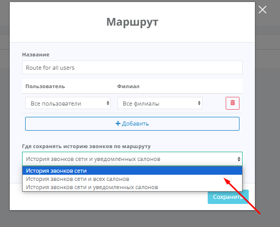
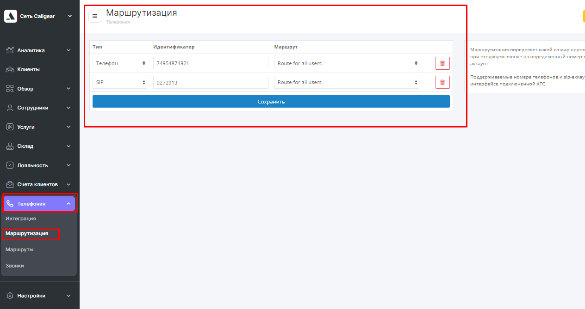

## Altegio - telephony integration   

**Integration value**    

Integration allows you to transfer data on calls from our personal account to Altegio.   

**Integration functionality**   

- pop-up notifications for incoming calls;
- saving call history and recordings in Altegio.
  

**Connecting integration**   

1. Click **"Active"** on this page.  

2. **Network** - indicate the name of the network with which you are connecting the integration. Integration is connected to each network separately, since the User token in Altegio is generated for each network.
3. Add **User token** from Altegio to field **Credential**.   
User token can be obtained in Telephony -> Integration, "Token" field.

  

4. **List of virtual numbers** - specify the virtual numbers for which you want to display call data in Altegio on the specified network.  
5. **Routing Method** - select which entity will be used for routing, SIP or extension.
6. Press **save**.  
7. In the Altegio account, after the settings have been made, additional sections will appear in the Network –> Telephony block:    
Routing, Routes and Calls (1), and the integration status will change to Integration connected (2)

 

8. In Altegio, go to the **Routes** section and build a route along which the call will go.  
There is only one default route – Route for all users.  
The default route setting is to save call history along the route in Network History. 

   

Click to open settings.  

  

With this setting, pop-up call notifications will not work, and calls will only be visible in the network call history.  
**Change the setting** to whatever suits you:  
   - call history of the network and all salons - a pop-up window about the call will appear in all branches of the network, the call will be visible in all branches in the Review - Calls section.
   - history of network calls and notified salons - a pop-up window about the call will appear in the branch/branches that will be selected in this route.  
  
9. After setting up the route, associate it with the phone number/telephony subscriber ID, sip or extension number to which calls are received.  
To do this, go to the **Routing** section.
   
Enter your company's phone number without the plus sign, parentheses, hyphens, spaces or other symbols and save.  
Altegio setup is complete.  
 

To check the operation of the integration on test calls, check the operation of the items specified in **"Integration functionality"**.  
If after all the settings calls do not appear in Altegio, check whether the phone numbers in Altegio routing and our Personal Account match.