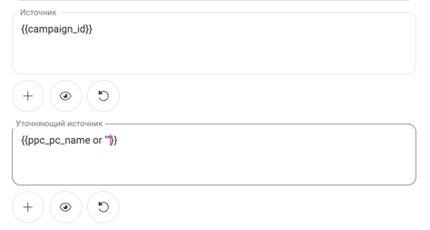

## Доступные функции

<details>
<summary style="font-weight:bold;">Описание возможностей</summary> <br />

### Звонки

- **Создание сущностей для входящих и исходящих звонков**: Возможность автоматически создавать сущности, такие как обращения, сервисные обращения или рабочие листы, на основе входящих и исходящих звонков. Дополняя набор правил из IVR и Виджета для более точного управления созданием сущностей. Или при определенных параметрах не создавать ничего.
- **Синхронизация пользователей и управление интеграцией**: Синхронизация пользователей из AutoCRM в CallGear
- **Шаблонизация полей**: Возможность использовать шаблонные значения для автоматизации создания источников
- **Виджет звонков**: Возможность использовать виджет CallGear Softphone для звонков и чатов внутри AutoCRM

### Чаты и заявки:

- **Обработка заявок в рабочее время**: Возможность откладывать создание сущностей, если заявка пришла не в рабочее время. Так же возможно использовать рабочее время сотрудника, если в правиле создания заявок выставлен ответственный за подходящую заявку. 
- **Виджет чатов**: Возможность использовать виджет CallGear Softphone работы с чатами внутри AutoCRM.
- **Создание сущностей на основе чатов**: Возможность автоматически создавать сущности на основе чатов и заявок.
  - Сущность по чату создается после окончания чата.
- ****

</details>

<br />

---

## Настройка интеграции

<details>
<summary style="font-weight:bold;">Начальные шаги и виджет CallGear Softphone</summary>

### Начальные шаги <br />

- **Авторизация**:
  - Введите авторизационные данные такие как домен от AutoCRM, логин и пароль пользователя API.
  <br>
  - Подтвердите и сохраните подключение.
- **Синхронизация пользователей**:
  - Нажмите на кнопку "Синхронизировать пользователей" для загрузки пользователей из AutoCRM в CallGear.
- **Настройка правил**:
    - Создайте правила для создания сущностей на основе звонков и чатов.
    - Настройте шаблоны для полей "Комментарий", "Источник" и "Уточняющий источник" для автоматизации создания источников.
    <details>
    <summary style="font-weight:bold;">Пример шаблона</summary> <br>
    
    ```jinja
    {{ campaign_name}}
    ```
    В данном примере, если кампания не определена, то в источнике будет строка None.<br>
    чтобы этого избежать или использовать дефолтное значение, можно использовать следующий шаблон:
    ```jinja
    {{ campaign_name or "Дефолтный источник" }}
    ```
  
    В данном примере, если кампания не определена, то будет использовано значение "Дефолтный источник".<br>
    Доступные поля есть в выпадающем списке.
    
    </details>
<br />


### Виджет CallGear Softphone

1.  **Установка**:
    - Используйте <a href="https://chromewebstore.google.com/detail/callgear/gmepbeelpjhhlnkccmclgijnnleadijl" style="color: blue; text-decoration: underline;">ссылку</a> для загрузки и установки виджета.
2.  **Авторизация**:
    - Войдите, используя свои учетные данные CallGear.
    - Авторизуйтесь в установленном виджете под той же учетной записью.
3.  **Проверка функциональности**:
    - Включите опцию "Показать softphone" в AutoCRM.
    - Убедитесь, что иконка виджета отображается.
</details>

## Особенности работы
<details>
<summary style="font-weight:bold;">Описание</summary> <br>

- **Базовые и уточняющие правила**: Базовые правила объединяются с уточняющими, которые применяются к конкретному звонку или заявке. Если поле заполнено в уточняющем правиле, оно перезаписывает данные из базового правила. Исключением является поле ответственного, оно перезаписывается всегда из уточняющего правила. В случае если поле не заполнено - будет взят ответственный из успешного звонка. 
- **Фильтрация по статусам Обращений\Рабочих листов**: Если не выбраны статусы, то сущность будет создаваться всегда. Если выбраны статусы, то сущность будет создана при условии, что обращение\рабочий лист не находится в выбранных статусах.
---
- **Поле "Комментарий", "Источник" и "Уточняющий источник"**: 
  - Эти поля имеют тип шаблона и поддерживают гибкую настройку с использованием Jinja-шаблонов. Это позволяет настраивать их под различные сценарии в зависимости от данных.
  
  - Если такого источника нет в AutoCRM, он будет создан автоматически.
  - Все доступные свойства, которые можно использовать в шаблонах, отображаются в выпадающем списке при настройке. Эти свойства могут немного различаться в зависимости от типа коммуникации (звонок или чат/заявка).<br> 
  
---
- **Создание сущностей**:
  - Сущности создаются на основе правил, которые могут быть базовыми или уточняющими.
  - Для создания РЛ дополнительно создается сущность Клиент, если таковой не существует. И потому все записи звонков прикрепляются к этому клиенту и их видно в любом РЛ клиента.
---
- **Отложенное создание сущностей**:
  - Если заявка пришла в нерабочее время, создание сущности откладывается до начала рабочего времени.
  - Если в правиле создания заявок указан ответственный, то создание сущности откладывается до начала рабочего времени в расписании ответственного.
  - Если в правиле создания заявок не указан ответственный, то создание сущности откладывается до начала рабочего времени которое указано в настройках интеграции.
  - Если у сотрудника не указано рабочее время, то создание сущности откладывается до начала рабочего времени в настройках интеграции.
---
</details>

## Поддержка <br />

Если у вас возникли проблемы или дополнительные вопросы, пожалуйста, свяжитесь с <a href="mailto:support@callgear.com" style="color: blue; text-decoration: underline;">службой поддержки CallGear</a> для получения помощи.
