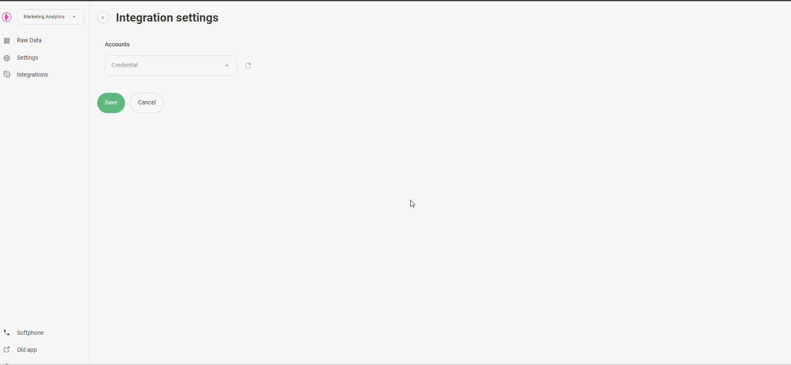
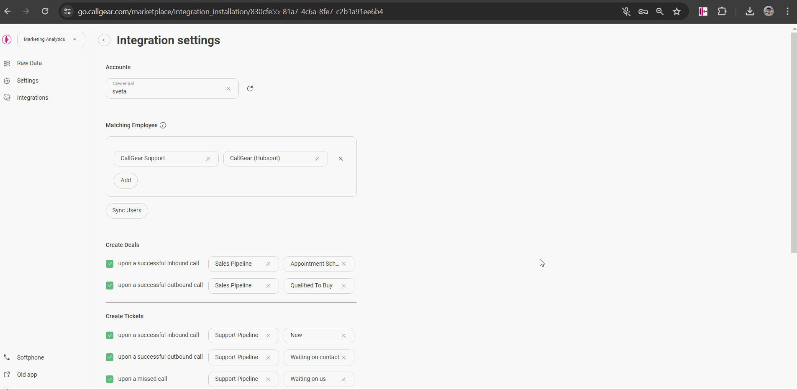
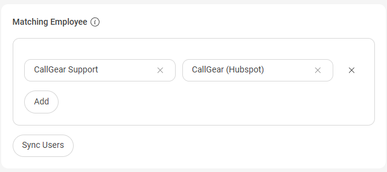
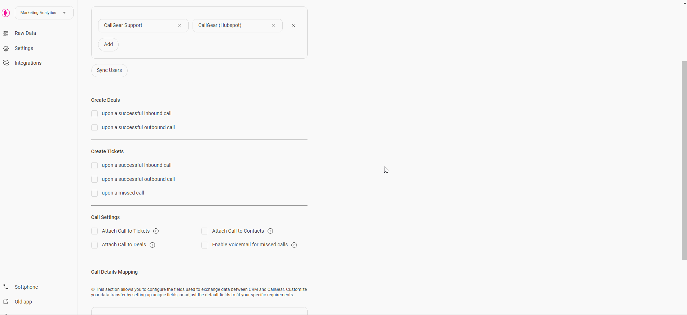
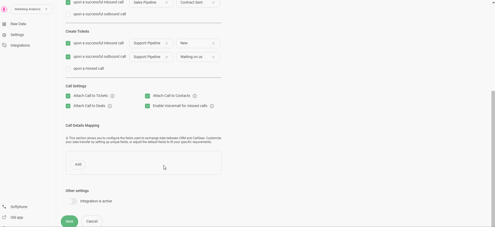

# HubSpot Integration  

These instructions are for users who wish to set up an integration between CallGear and HubSpot CRM. Below is the functionality as well as the steps to set up the integration.

## Available Features  

Click to expand/collapse
  

- **Automated Contact and Call Creation**: Easily generate contact and call records during incoming and outgoing calls with seamless automation.
- **Automated Call Routing**: Route calls to the appropriate manager (Сontact Щwner) in HubSpot, ensuring efficient communication management.
- **Deal Creation**: Automatically initiate deals after successful inbound and outbound calls, facilitating a fast sales process.
- **Ticket Creation**: Automate the creation of tickets for successful inbound, outbound or missed calls, providing comprehensive customer support management.
- **Flexible Call Attachment Options**: Customize call attachments by linking call recordings/voicemail and related information to related tickets, deals or contacts.
- **Customized Data Transfer**: Customize how data transfers from CallGear to specific HubSpot fields to improve data integrity.
- **Softphone Widget**: Initiate inbound and outbound calls directly within your CRM system with a convenient Softphone widget, enabling quick and efficient communication with customers and prospects.

 

---

## Integration Setup  

Initial Setup Steps & CallGear Softphone Widget

### Initial Steps  

- **Authorization**:
    - Log into <a href="https://app.hubspot.com/" style="color: blue; text-decoration: underline;">HubSpot</a> with your credentials.
    - Save and confirm the connection.
  
  
  
 

### CallGear Softphone Widget  

1.  **Installation**:
    - Use the <a href="https://chromewebstore.google.com/detail/callgear/gmepbeelpjhhlnkccmclgijnnleadijl" style="color: blue; text-decoration: underline;">provided link</a> to download and install the widget.
2.  **Authorization**:
    - Authenticate using your CallGear account credentials.
    - Log in to the installed widget under the same account.
3.  **Functionality Check**:
    - Enable the "Show softphone" option within <a href="https://app.hubspot.com/" style="color: blue; text-decoration: underline;">HubSpot</a>.
    - Make sure that the widget icon is displayed.
  
  

 

Entity Creation Settings (Calls)

### Custom Matching Employee  

_Incoming calls are forwarded to the Contact Owner (personal manager) identified in HubSpot._

- Automatic matching: After integration, employees are automatically mapped and calls are forwarded based on user's email.
- UI matching: Manually match employees in the UI, and these mappings will take precedence over automatic matching.

 

 

### Data Transfer Setup  

- **Call Transfer Control**:
  - Enable or disable the creation of tickets or deals according to your needs.
  - Configure tickets and deals creation settings, including pipeline and stage.
 

- **Attaching Call Recordings**:
  - Define sources from which you want to receive recordings and call information.
  - Enable feature to automatically attach voicemail recordings to appropriate contacts if voicemail is configured.
  
  
 

- **Call Details Mapping**:
  - Configure the transfer of call information from CallGear to HubSpot:
    - Choose an object type: Contacts, Deals, Tickets.
    - Select the information you want to transfer from CallGear.
    - Select the field in the HubSpot object to which this information will be transferred.

   

 

Entity Creation Settings (Chats)
  

- **Most settings for creating entities in chats are similar to calls, with a few key differences:**
  

  - Entities are created once per chat session, triggered by either a client or employee first message, regardless of the number of messages exchanged before the chat closes.
    
  - When a client sends the first message, no employee is assigned yet, so an owner can’t be set. The owner can be updated after an employee replies, if enabled in the integration. 
    
  - If the client’s phone number is hidden, only a Ticket can be created, provided the integration settings allow it. Otherwise, nothing is created.

 

---

## Support  

If you have any problems or additional questions, please contact <a href="mailto:support@callgear.com" style="color: blue; text-decoration: underline;">CallGear Support</a> for assistance.