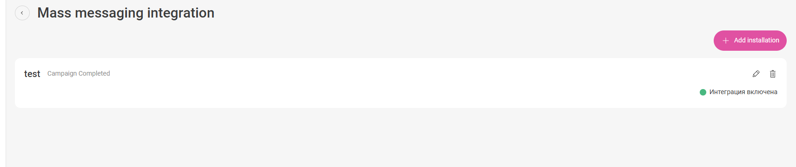
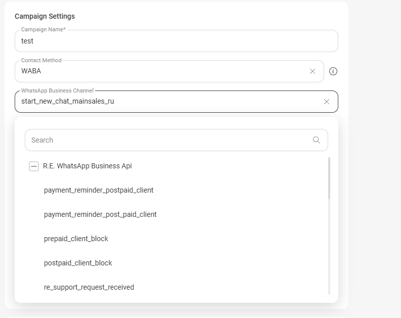
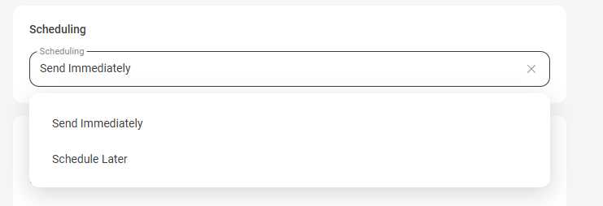
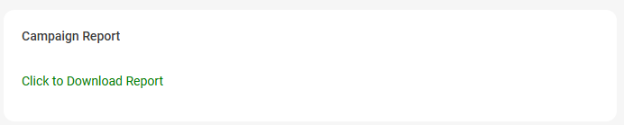

# Mass Messaging  

The solution enables bulk messaging to customers via WABA channel or SMS.  

## Integration Setup  
1. **Campaign Name** - enter the campaign name for display in reports and on the integration connection page.    

2. **Contact Method** - select the communication channel for the messaging campaign.  

  
 Available Settings 
  

2.1 **WABA Channels:**  

- When selecting WABA, an additional **WABA Channel** field will appear where you need to choose your WABA channel and the template that will be used in the campaign.  
  
 

2.2 **SMS Channels:**  

- When selecting SMS, an additional **SMS Channel** field will appear where you need to choose your SMS channel.  

- A **Message Text** field will also appear where you need to specify the text to be sent in the campaign. This field supports variables.  
**Important!** SMS channel has limitations on the number of characters per message. Up to 70 characters (Cyrillic) or 160 (Latin). If the text is longer, it will be sent as multiple messages (maximum: 335 Cyrillic characters or 765 Latin). The character counter below the template input field doesn't account for variable values - the final SMS length may differ.  

 

 

3. **Download Campaign Template File** - click the text to download the messaging template file to your computer.  

4. **File Upload Field** - drag and drop your messaging file here. The file must be in CSV format, smaller than 10MB. The file should contain phone numbers (the solution reads any Russian number format) and, if necessary, variables. Required separator - semicolon.  

5. **Remove Duplicates** - this setting allows excluding duplicate numbers added in the file.  

6. **Add to Contact List** - when this toggle is enabled, an additional file upload field will appear. This setting is necessary if your customer database is split into two files.  

7. **On File Removal** - this setting allows specifying what to do with remaining mailing entries when deleting files in points 5 and 6.  

8. **Messages Per Minute** - set the maximum number of messages to process per minute. Maximum 300 messages per minute. 

9. **Scheduling** - select the start time for the campaign. Available options: send immediately or at your chosen time.  

10. **Campaign Controls** - set of controls for managing the campaign.  
 - **Pause Campaign** - allows pausing a running campaign. Available only when campaign is active.  
 - **Resume Campaign** - allows resuming a stopped campaign. Available when campaign is paused.  
 - **Clear Campaign Data** - allows deleting loaded contacts, completely clearing the queue. Available for both stopped and running campaigns.  
 - **Restart Campaign** - allows sending the campaign again to all files loaded in points 5 and 6. Available for completed campaigns.   
11. **Campaign Report** - click the text to download the campaign report.

**Important!** In RMO, chats with messages from the campaign will only appear after receiving a customer response to a campaign message.  

 
