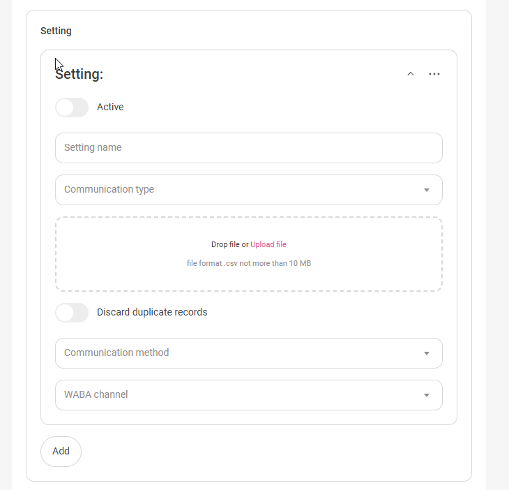

## Bulk Messaging  

The solution enables mass message distribution to customers through the WABA channel.  

## Integration Setup    

1. When configuring the integration, in the "Additional Integration Parameters" section, select your desired channel from the "Available Channels" dropdown (note: currently only WABA channel is supported for bulk messaging) and click "Save". This subscribes you to the channel for future campaign setup.  

 
2. After successful saving, navigate to the "Settings" section and click "Add". This opens the campaign configuration panel where you should activate the "Active" toggle.  

 
3. Configure the required settings:  

 
3.1. **Configuration Name** - your campaign identifier (used to track delivery status in reports).  
3.2. **Request Type** - select CSV format from the dropdown, then upload the corresponding file.  
   <mark>**Important!**  For successful campaign processing, ensure your file meets these requirements::</mark>

   <mark>Must be CSV format with values in strict order: phone; datetime; variable1; variable2; etc. 
   All values semicolon-separated (;)
   Datetime format: YYYY-MM-DD HH:MM:SS (e.g., 2021-06-21 22:02:00)
   Note: Datetime must match the sender's account timezone.
   Variables are optional (include only when using variable templates)

   <mark>File example:</mark>

   <mark>79207460022; 2021-06-21 22:02:00; customer; promotion  
   <mark>79256760044; 2021-06-20 21:02:00; customer; offer  
   <mark>79456760044; 2021-06-19 20:02:00; customer; gift    </mark>
   
3.3. **Ignore Duplicates** - prevents sending to duplicate numbers.  

3.4. **Contact Method** - selects channel type for distribution  

3.5 **Communication Channel** -chooses sending channel (for WABA, select your template).  

3.6. **Add** - creates a settings duplicate.    
4. After file upload and channel selection, click "Save" to trigger file validation.  
Invalid entries will show in a popup with error details.
Successful saving imports data and schedules campaigns according to CSV timestamps.  
5. Click "Download Report" to export an Excel file with:

Recipient phone number

Scheduled send datetime

Campaign name

Delivery status

Template name (WABA channel)  

 
In CRM, campaign message threads appear only after customer reply.  
6. **Verify Settings** - checks status of selected channels. Results appear in "Settings Status" section.  

 
