# Pipedrive CRM Integration

These instructions are for users who wish to set up an integration between CallGear and Pipedrive CRM. Below is the functionality as well as the steps to set up the integration.

## Available Features

Click to expand/collapse

- **Automated Contact, Lead, Deal Creation**: Automatically create contacts or leads or deals after successful inbound, outbound, or missed calls.
- **Automated Call Routing**: Route calls to the appropriate manager (contact owner) in Pipedrive CRM, ensuring efficient communication management.
- **Flexible Call Attachment Options**: Customize call attachments by linking call recordings/voicemail and related information to related entities.
- **Customized Data Transfer**: Customize how data transfers from CallGear to specific Pipedrive CRM fields to improve data integrity.
- **Click-to-Call Widget**: Initiate outbound calls directly within your CRM system with a convenient Softphone widget, enabling quick and efficient communication with customers and prospects.

## Integration Setup

Initial Setup Steps & CallGear Softphone Widget

### Initial Steps

1. **Account Login**:
    - Go to the CallGear platform and log in to your account.
2. **Turn on integration**:
   - Go to the Integration section (left sidebar).
   - Click on Pipedrive CRM in the list of integrations and proceed to its configuration.
    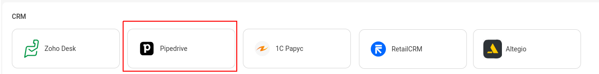
3. **Authorization**:
    - Add Pipedrive CRM Credentials Name.
    - Save and confirm the connection. 
      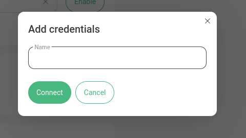
    - Sign in yor Pipedrive account 
   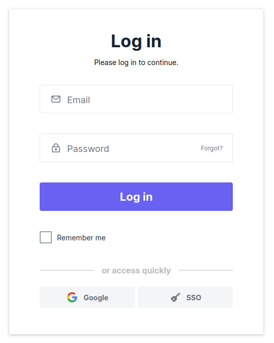
    - Accept access 
   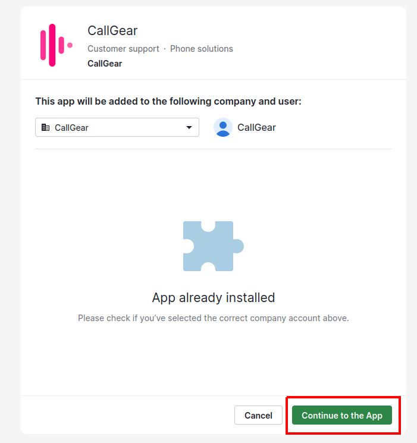
    - Select branch by your account domain
      - CallGear - callgear.com
      - CallGear UAE - callgear.ae 

    - Account connected. 
   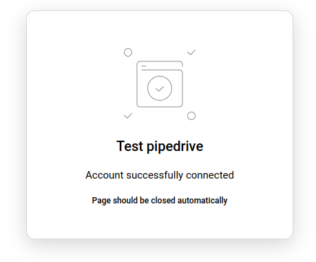
### CallGear Softphone Widget

1. **Installation**:
    - Use the [provided link](https://chromewebstore.google.com/detail/callgear/gmepbeelpjhhlnkccmclgijnnleadijl) to download and install the widget.
2. **Authorization**:   
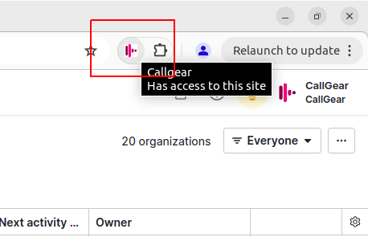
    - Log in to the installed widget under your CallGear account.
   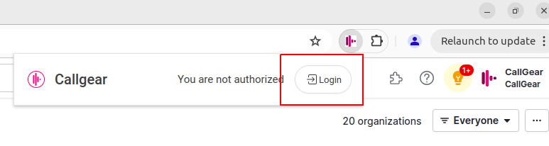
   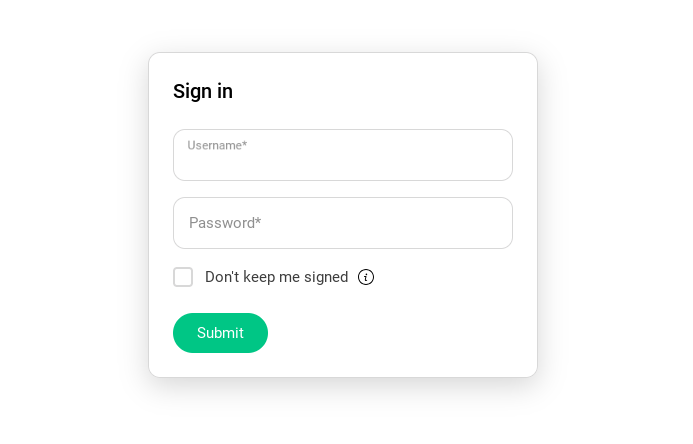
    - Reload page.
3. **Functionality Check**:
    - Enable the "Show softphone" option within Pipedrive CRM. 
   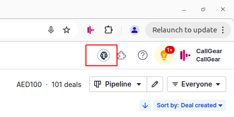
    - Make sure that the widget icon is displayed. 
   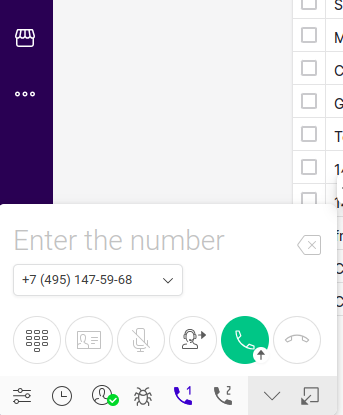

    

Integration Settings (Calls)

### Data Transfer Setup

- **Call Transfer Control**:
  - Enable or disable the creation of leads, deals, activities according to your needs.
  - Configure leads and deals creation settings, including pipeline and stage for deals and "Visible to" for both.
     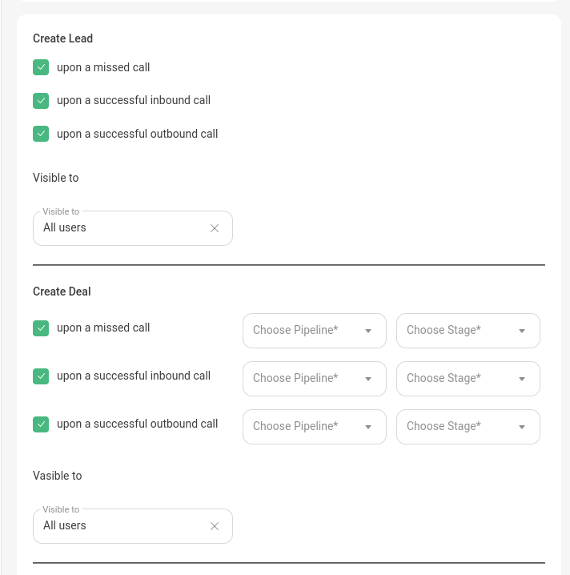
- **Attaching Call Recordings**:
  - Define sources from which you want to receive recordings and call information.
  - Enable feature to automatically attach voicemail recordings to appropriate contacts if voicemail is configured.
  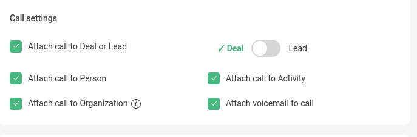
- **Call Details Mapping**:
  - Configure the transfer of call information from CallGear to Pipedrive CRM:
    - Choose an object type: Persons,  Deals or Activities.
    - Select the information you want to transfer from CallGear.
    - Select the field in the Pipedrive CRM object to which this information will be transferred.
     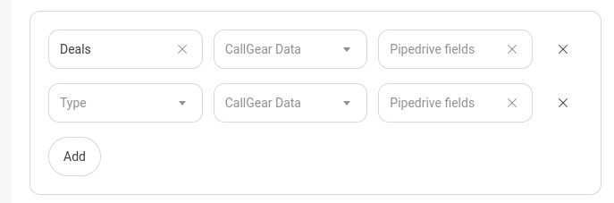
  
### Matching Employee

_If the system identifies a Pipedrive CRM customer on an incoming call, the call is automatically forwarded to their Contact Owner (personal manager)._
- Configure a custom match between CallGear and Pipedrive CRM users to route calls to the responsible manager (contact or lead owner).
   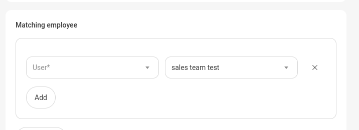

Integration Settings (Chats)
  

- Most settings for creating entities in chats are similar to calls, with a few key differences:
  

  - Entities are created once per chat session, triggered by either a client or employee first message, regardless of the number of messages exchanged before the chat closes.
    
  - When a client sends the first message, no employee is assigned yet, so an owner can’t be set. The owner is assigned automatically by Pipedrive, and can be updated after an employee replies, if enabled in the integration. 
    
  - If the client’s phone number is hidden, entity names will contain information about this.
  

## Support

If you encounter any issues or have further questions, please reach out to [CallGear Support](mailto:support@callgear.com) for assistance.
