# SalesForce Custom Object  

These instructions are for users who wish to set up an integration between CallGear and SalesForce CRM. Below is the functionality as well as the steps to set up the integration.

 

---
## Integration Setup  
If you have already connected main Salesforce integration, you can choose the same credentials and skip this section.

Salesforce Settings
  

This section guides users on how to create a connected app within Salesforce. A connected app allows external applications to securely integrate with Salesforce using OAuth authentication.

- **Create a Connected App**:
  - Log in to your [Salesforce account](https://login.salesforce.com).
  - Go to advanced settings

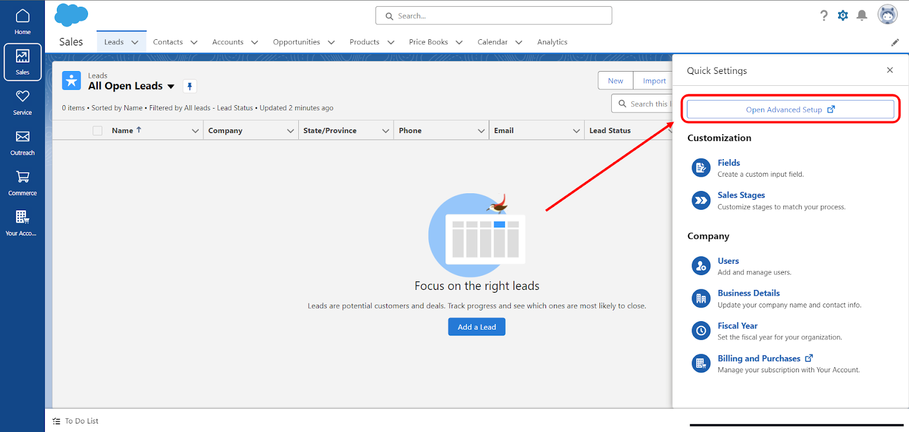

- Navigate to Setup > Apps > App Manager.

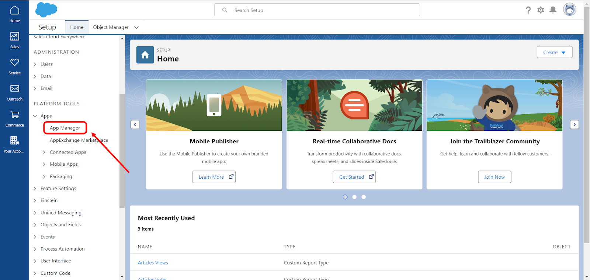

- Click on 'New Connected App'.

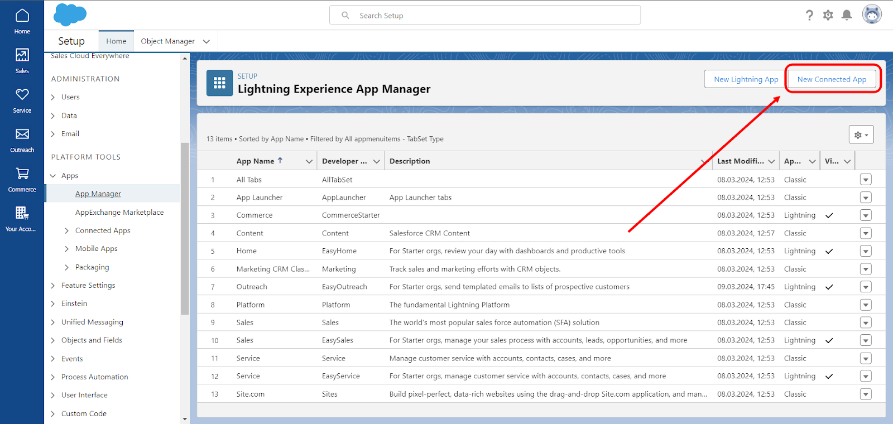

- **Fill in the required details**:
  - Connected App Name: [Your App Name]
  - API Name: [Your_API_Name]
  - Contact Email: [Your Email Address]

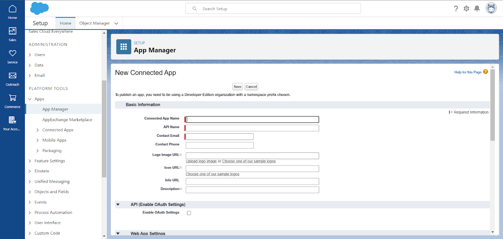

- **Enable OAuth Settings: Must be checked**:
  - Callback URL:
    - https://uc-http-requester-dub-api.callgear.ae/oauth2/callback
    - https://uc-http-requester-lat-api.callgear.com/oauth2/callback

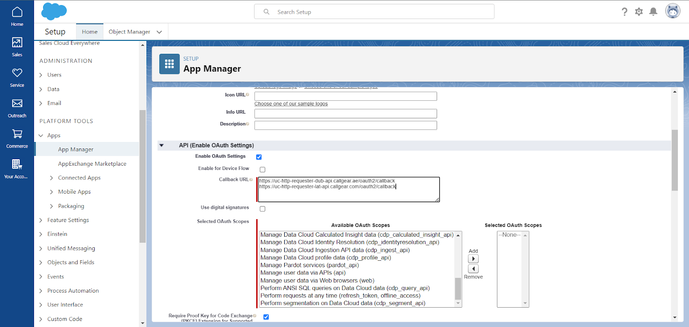

- Selected OAuth Scopes: Select required scopes based on your application needs.
- Also unchecking box “Require Proof Key for Code Exchange (PKCE) Extension for Supported Authorization Flows” and save.

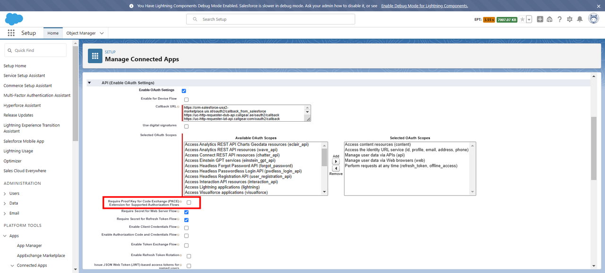

- Save the changes.
- After saving, click on the “Initial Access Token” button.

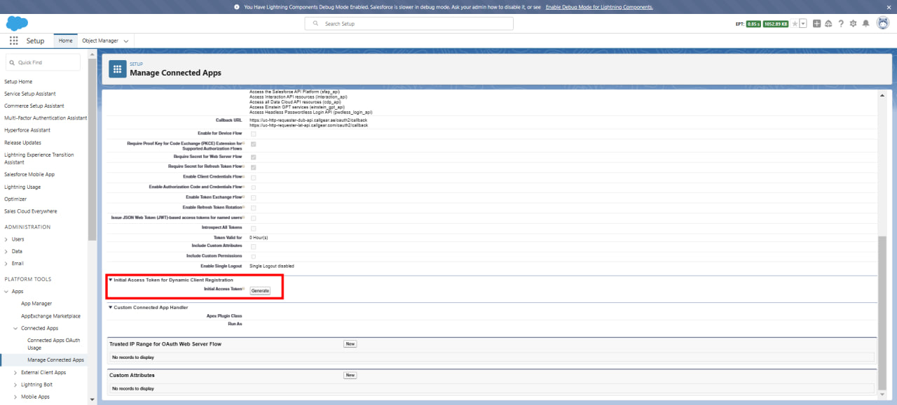

 

Configure OAuth Settings
  

- Once the Connected App is created, note down the 'Consumer Key' and 'Consumer Secret'. These will be used for authentication.
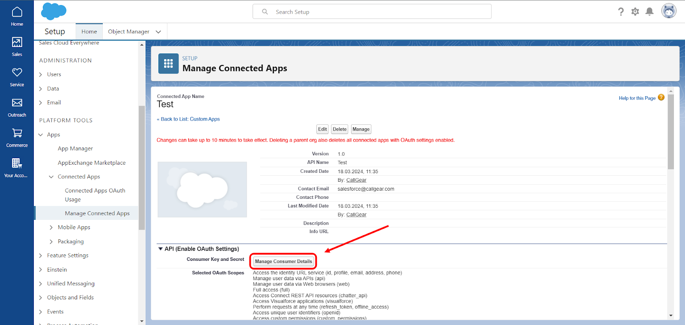
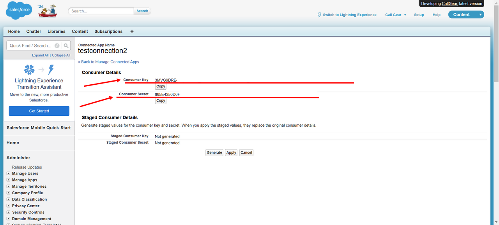

- Under the same Connected App settings, configure the OAuth policies, such as refresh token policy, token validity, etc., according to your requirements.

 

CallGear Credentials Settings
  

#### Set Up Credentials  
  - Log in to your CallGear account using one of these links - https://go.callgear.com/ or https://go.callgear.ae/ 
  - Go to Marketplace and select SalesForce integration
  - Enter your Salesforce account URL and provide the necessary authentication keys from your Salesforce Connected App.

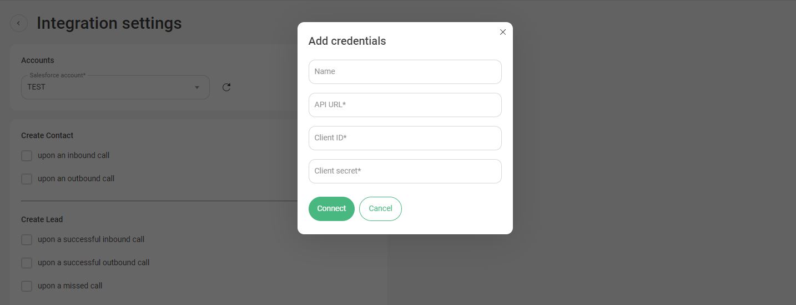

 

Entity Creation Settings
  

- You can add up to 25 different Salesforce objects. 

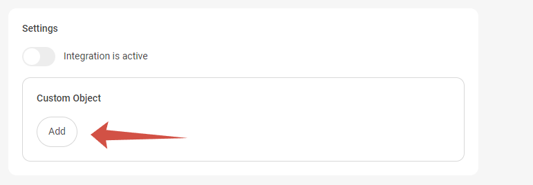

- Select the object type you want to create.
  - Every field in one object should have the same object type.

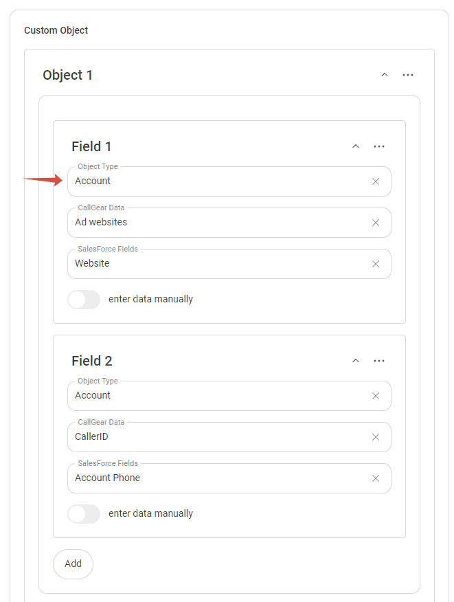

- Select CallGear and SalesForce fields.
  - Select the information you want to transfer from CallGear.
  - Select the field in the SalesForce object to which this information will be transferred.
  - SalesForce fields marked with ** are required. Without setting these fields, the object will not be created.
  - SalesForce fields marked with * if not set, the value will be defaulted on creation by SalesForce settings.
  - After the call finishes, the object will be created in Salesforce.

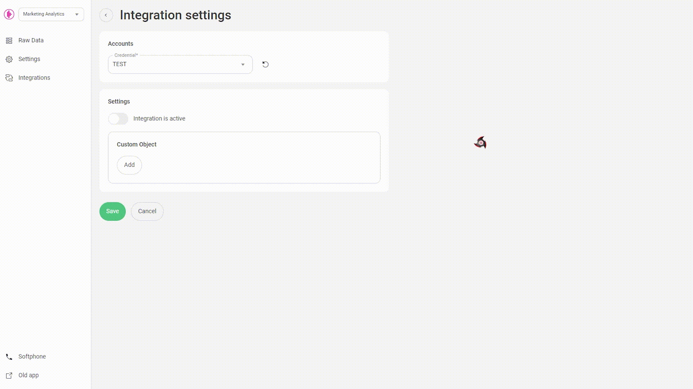

- Instead of selecting CallGear field, you can write your own text.

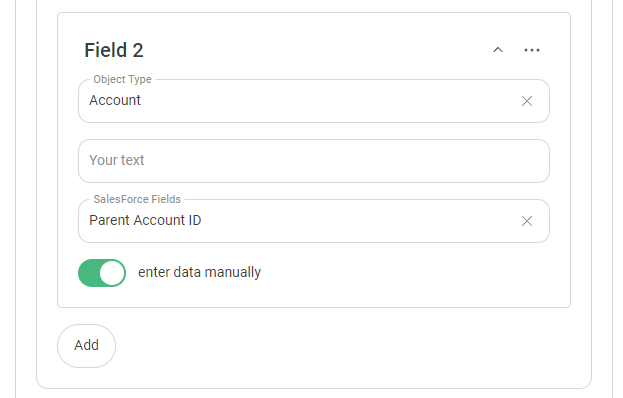

- You can concatenate multiple CallGear fields with each other or with manual text in one SalesForce field.

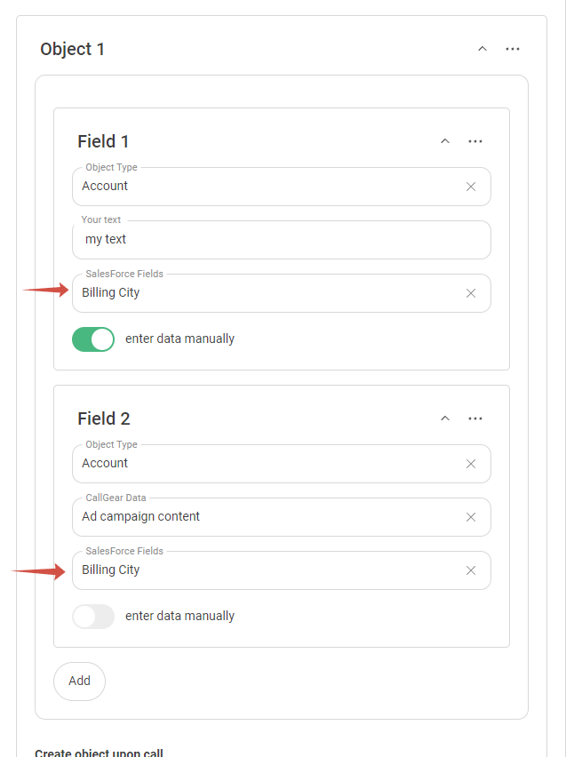

- Select the type of call at which the object will be created

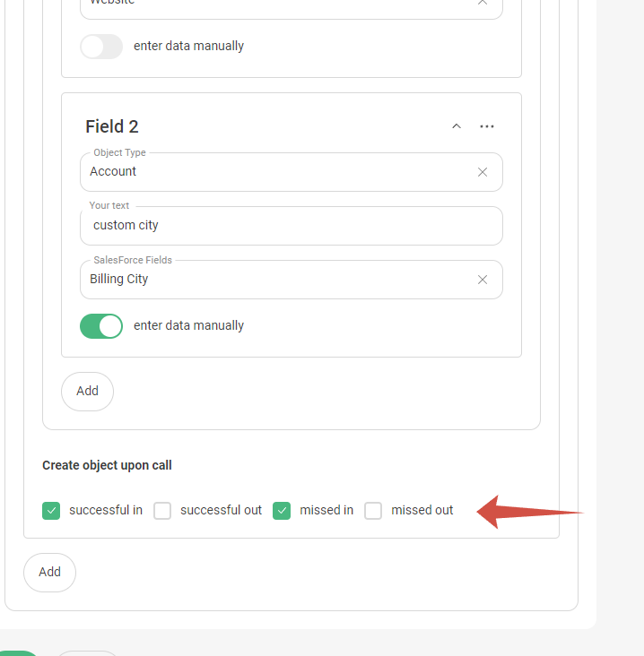

---

## Support  

If you have any problems or additional questions, please contact <a href="mailto:support@callgear.com" style="color: blue; text-decoration: none;">CallGear Support</a> for assistance.