# Leadsquared Integration

## Available features

<details>
<summary>Click to expand/collapse</summary>

- **Automated Lead Creation**: Automatically create leads after successful inbound, outbound, or missed calls.
- **Automated Call Routing**: Route calls to the appropriate manager (customer owner) in Leadsquared, ensuring efficient communication management.
- **Click-to-Call Widget**: Initiate inbound and outbound calls directly within your Leadsquared system with a convenient Softphone widget, enabling quick and efficient communication with customers and prospects.

</details>

## Integration Setup

<details>
<summary>Initial Setup Steps & CallGear Softphone Widget</summary>

### Initial Steps

1. **Turn on integration**:
    - Go to the Integration section (left sidebar).
    - Click on Leadsquared in the list of integrations and proceed to its configuration.
2. **Authorization**:
    - Add Leadsquared Credentials Name.
    - Go to Leadsquared Settings - API and Webhooks. <br>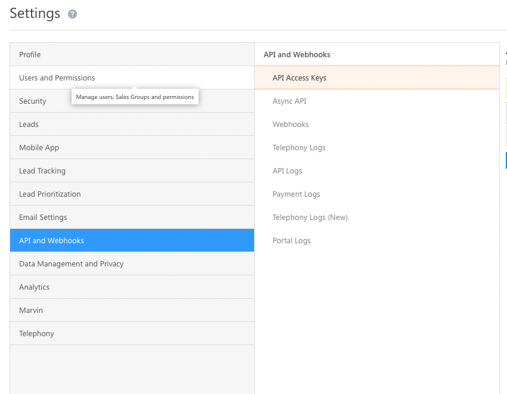
    - Copy API host, API Key and Secret Key. <br>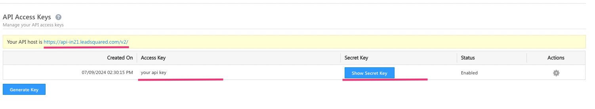
    - Paste this data into the credentials form.<br> 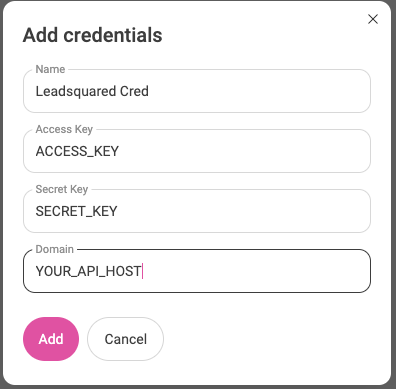
    - Click add and that’s it.

### CallGear Softphone Widget <br />

1.  **Installation**:
    - Use the <a href="https://chromewebstore.google.com/detail/callgear/gmepbeelpjhhlnkccmclgijnnleadijl" style="color: blue; text-decoration: underline;">provided link</a> to download and install the widget.
2.  **Authorization**:
    - Authenticate using your CallGear account credentials.
    - Log in to the installed widget under the same account.
3.  **Functionality Check**:
    - Enable the "Show softphone" option within <a href="https://leadsquared.com/" style="color: blue; text-decoration: underline;">Leadsquared</a>.
    - Make sure that the widget icon is displayed.

</details>

<details>
<summary>Integration with LeadSquared Mobile Connector</summary>


 **Integrate with LeadSquared Mobile Connector**:
   - Install the connector from Marketplace <br> 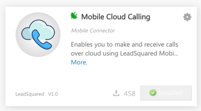
   - Use the modified webhook URL (with the appended endpoint path) in your LeadSquared Mobile Connector configuration.
   - After installation, click on the gear icon and proceed to configure.
   - Select the preferable setting. In our case, we use Only cloud calling with Phone as User field with Virtual Number <br> 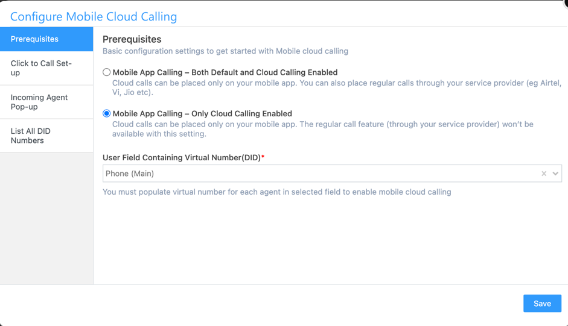
   -  **Click2Call**:
       - Click on the `Click to Call Set-up` button and paste the webhook URL you get in the `Webhook URL` and append the endpoint path to it. Set method to `POST` and paste the body template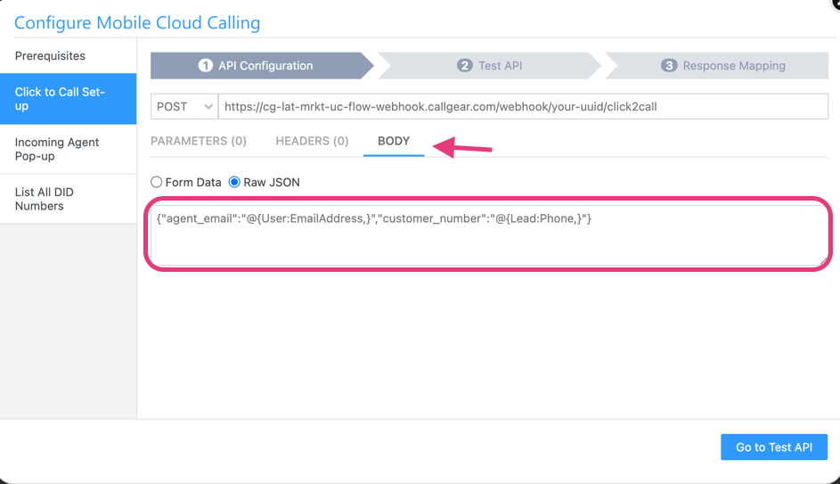
       - ```json
             {"agent_email": "@{User:EmailAddress}","customer_number": "@{Lead:Phone}"}
         ```
       - Click `Go to Test API`, then enter some data from your Leadsquared account and click `Test And Map Response`. If everything is correct, you will see the response
      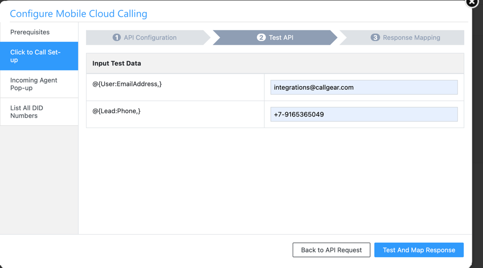
       - Map the response and click `Save` <br>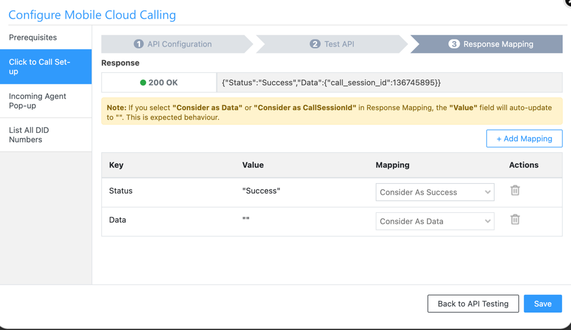
   - **Pop-up**: 
       - Click on the `Incoming Agent Pop-up` button and paste the webhook URL you get in the `Webhook URL` and append the endpoint path to it. Set method to `POST` and paste the body template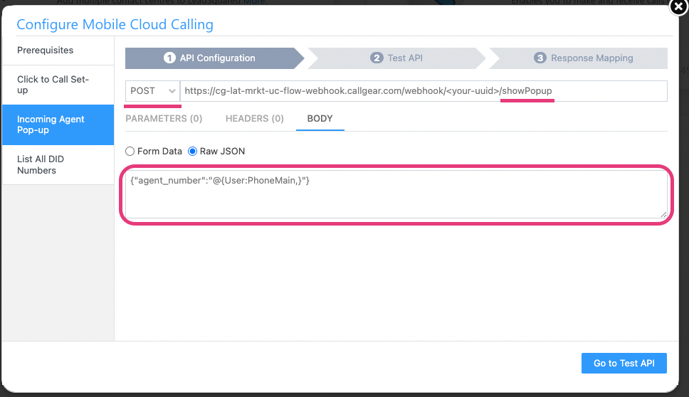
       - ```json
             {"agent_phone": "@{User:PhoneMain}"}
         ```
       - Click `Go to Test API`, then press `Test And Map Response`. If everything is correct, you will see the response <br>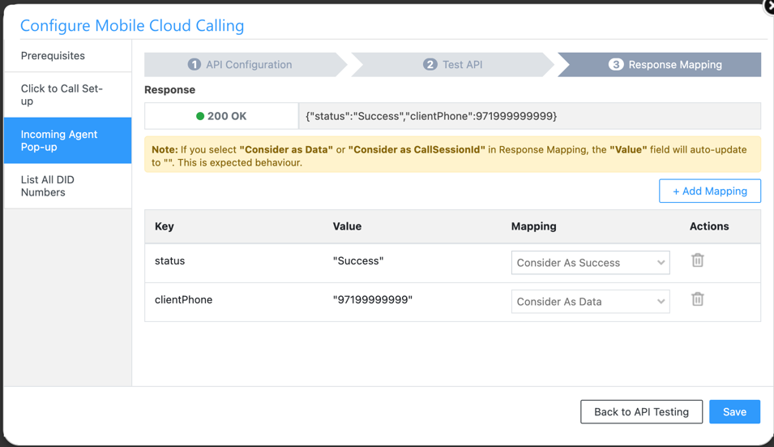
       - Map the response and click `Save` <br>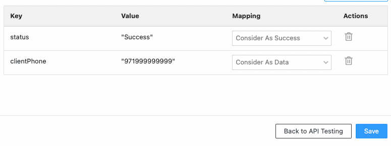
   - **DID**:
       - Click on the `DID` button and paste the webhook URL you get in the `Webhook URL` and append the endpoint path to it. Set method to `GET` <br>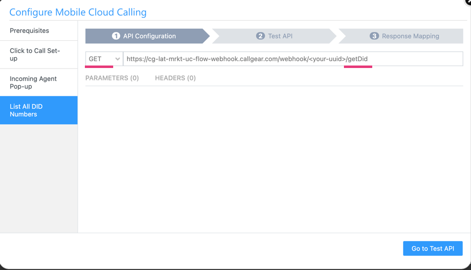
       - Click `Go to Test API`, then press `Test And Map Response`.
       - Map the response and click `Save`  <br>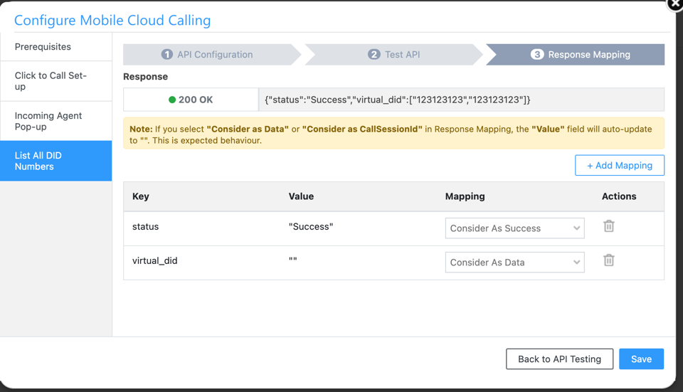
   - That’s it. Now you can use the CallGear Softphone Widget with LeadSquared Mobile Connector.

</details>

<details>
<summary>Syncing Details</summary>

### Sync Contacts
Synchronizes contacts from Leadsquared to CallGear by parsing new leads. If the lead has a meaningful name (not just a phone number) and the phone number is not already in the contact book, the contact will be synced.

### Sync Users
Synchronizes users from Leadsquared to CallGear. A user will be synced if there is no user with the same email in CallGear.

</details>