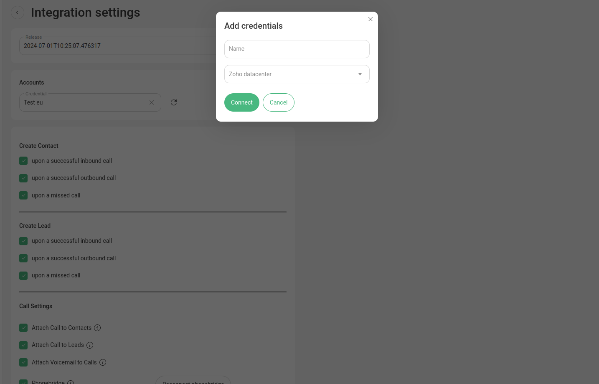
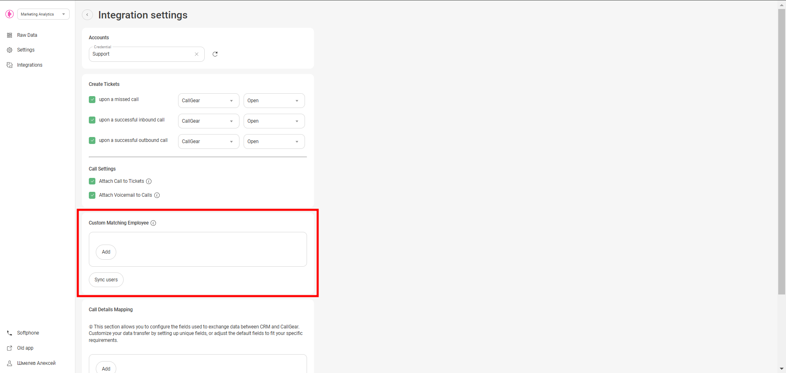
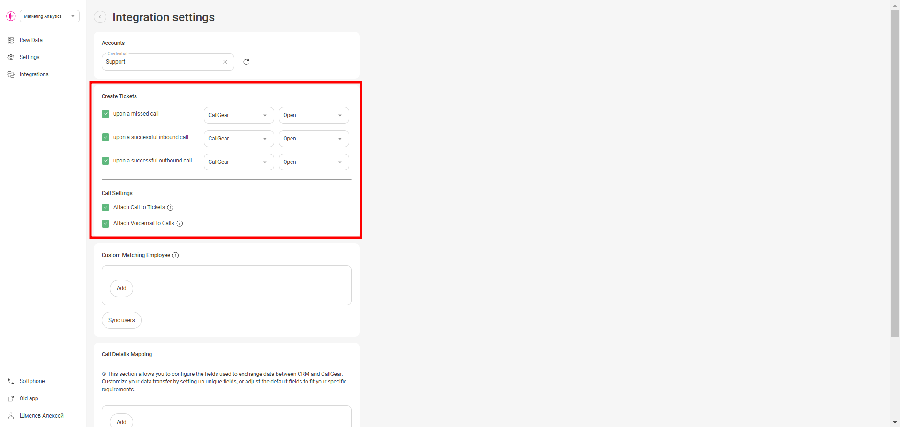
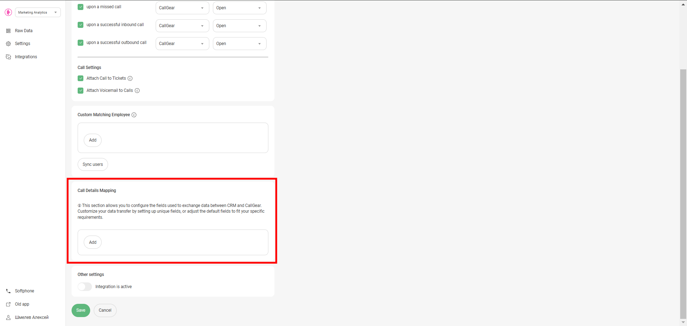

# Zoho Desk Integration

These instructions are for users who wish to set up an integration between CallGear and Zoho Desk. Below is the functionality as well as the steps to set up the integration.

## Available Features

Click to expand/collapse

- **Automated Ticket Creation**: Automatically create customers and tickets after successful inbound, outbound, or missed calls.
- **Automated Call Routing**: Route calls to the appropriate manager (customer owner) in Zoho Desk, ensuring efficient communication management.
- **Flexible Call Attachment Options**: Customize call attachments by linking call recordings/voicemail.
- **Customized Data Transfer**: Customize how data transfers from CallGear to Zoho Desk to improve data integrity.
- **Click-to-Call Widget**: Initiate inbound and outbound calls directly within your Desk system with a convenient Softphone widget, enabling quick and efficient communication with customers and prospects.

## Integration Setup

Initial Setup Steps & CallGear Softphone Widget

### Initial Steps

1. **Account Login**:
    - Go to the CallGear platform and log in to your account.
2. **Turn on integration**:
    - Go to the Integration section (left sidebar).
    - Click on Zoho Desk in the list of integrations and proceed to its configuration.
   
3. **Authorization**:
    - Add Zoho Desk Credentials Name.
    - Select your Datacenter.
    - Save and confirm the connection.
   
    - Sign in yor Zoho account
   
    - Accept access
   
    - Account connected.
   

### CallGear Softphone Widget

1. **Installation**:
    - Use the [provided link](https://chromewebstore.google.com/detail/callgear/gmepbeelpjhhlnkccmclgijnnleadijl) to download and install the widget.
2. **Authorization**:
    - Authenticate using your CallGear account credentials.
    - Log in to the installed widget under the same account.
3. **Functionality Check**:
    - Enable the "Show softphone" option within Zoho Desk.
    - Make sure that the widget icon is displayed.

Integration Settings

### Matching Employee

- Configure a custom match between CallGear and Zoho Desk users to automatically route calls to the responsible manager (customer owner).
   
_If the system identifies a Zoho Desk customer on an incoming call, the call is automatically forwarded to their Customer Owner (personal manager)._

### Data Transfer Setup

- **Call Transfer Control**:
  - Enable or disable ticket creation and configure its settings, including pipeline and stage, according to your needs.
   
- **Attaching Call Recordings**:
  - Define sources from which you want to receive recordings and call information.
  - Enable feature to automatically attach voicemail recordings to appropriate entities if voicemail is configured.
- **Call Details Mapping**:
  - Configure the transfer of call information from CallGear to Zoho Desk:
    - Select the information you want to transfer from CallGear to Tickets.
    - Select the field in the Zoho Desk object to which this information will be transferred.
   

## Support

If you encounter any issues or have further questions, please reach out to [CallGear Support](mailto:support@callgear.com) for assistance.
