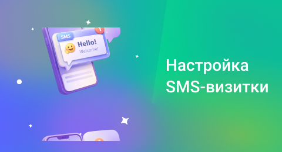

## SMS-визитка

 
 

 
 

**SMS-визитка** позволяет автоматически отправлять клиенту контактные данные после разговора. Это помогает сократить время на обмен контактами и повышает удобство для клиента.

 
 

<Alert type="info">Визитки отправляются только в период с 9:00 до 20:00 по московскому времени (GMT+3). Отправка происходит после завершения разговора — входящего или исходящего, в зависимости от выбранных условий.</Alert>

 
 

### Создание визитки

 
1. Нажмите «Добавить SMS-визитку» и задайте её название.
2. Выберите номер или несколько номеров. Визитка будет отправлена после звонка с участием этого номера.
3. Выберите направление звонков, при котором отправится SMS.
4. Введите текст SMS. В одном сообщении помещается до 70 символов на русском и до 140 на английском; при превышении лимита сообщение будет разбито на несколько частей (до 404 символов суммарно).
5. Укажите, нужно ли добавить имя, почту и внутренний номер сотрудника в текст SMS. Данные берутся из карточки <a href="/account/staff/employee-staff">сотрудника</a>.
6. Настройте, кого считать «новым клиентом». Если не хотите отправлять визитку при каждом обращению, укажите интервал в днях (минимум один). Клиенты, с кем не было контакта дольше указанного срока, будут считаться новыми, и SMS отправится повторно.

 
 

<Alert type="info">При отправке SMS на экране клиента отобразится имя отправителя — **UIS**. Изменить его невозможно из-за юридических требований. Название компании можно указать в тексте сообщения.</Alert>

 
 

### Ручная отправка

 

Если визитка включена, но не выбрано ни одно направление звонка, автоматической отправки не будет. В таких случаях SMS можно отправить вручную через <a href="/pbx/talk_options">опцию разговора</a>.

 
 

### Отражение в отчётах

 

В отчёте «Звонки» отображается столбец «SMS». Если визитка была отправлена, в нём будет указано название шаблона. Прочерк означает, что сообщение не отправлялось.

 
 
 
 
 
 
