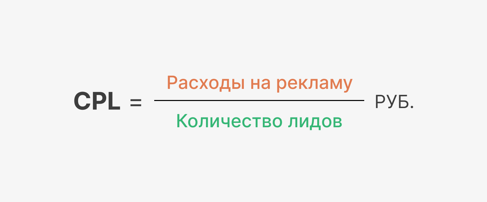

 
 

## Как считать стоимость лида (CPL)

 
 

Стоимость лида - это сумма, которую вы потратили на то, чтобы человек совершил целевое действие, оставив свои контактные данные: телефон или адрес электронной почты. 

 
 

 
 

Например, одна из рекламных кампаний в VK Ads принесла нам 50 лидов при затратах 30 тыс. рублей. Стоимость лида составила 600 рублей. Стоимость лидов, которые привела вторая рекламная кампания, в два раза выше при тех же затратах. Если качество лидов из этих кампаний одинаковое и конверсия в покупку примерно равна - то нам нет смысла переплачивать за обращение и стоит масштабировать первую кампанию.

 
 

<button b_to="/demo/cpl/Marketing.md" b_type="fill" b_theme="primary">Продолжить</button>
<button b_to="/demo/cpl/9Screen.md" b_type="outline" b_theme="secondary">Назад</button>