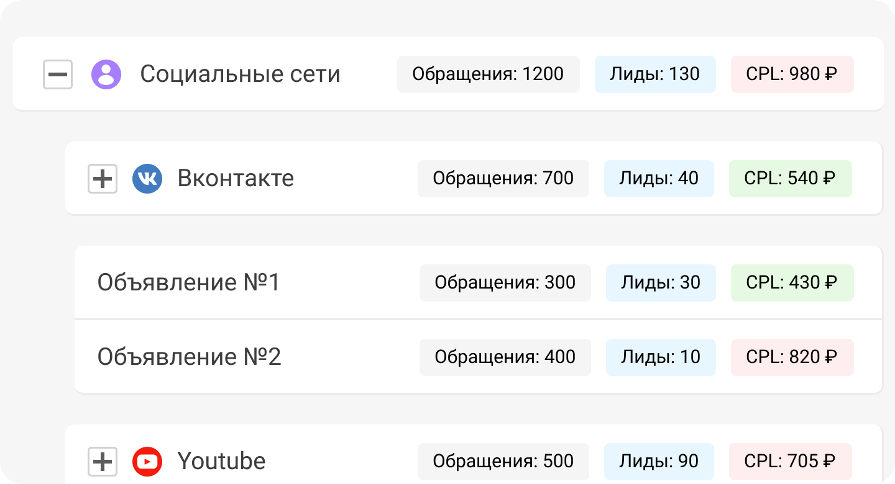

 
 

## Как собрать все лиды и оценить их качество?

 
 

 
 

Расскажем, как с помощью UIS собрать лиды и определить, какие из них целевые. Понимание качества и стоимости лидов позволит вам найти и масштабировать работающие рекламные каналы.

 
 

<button b_to="/demo/cpl/2Screen.md" b_type="fill" b_theme="primary">Начать</button>