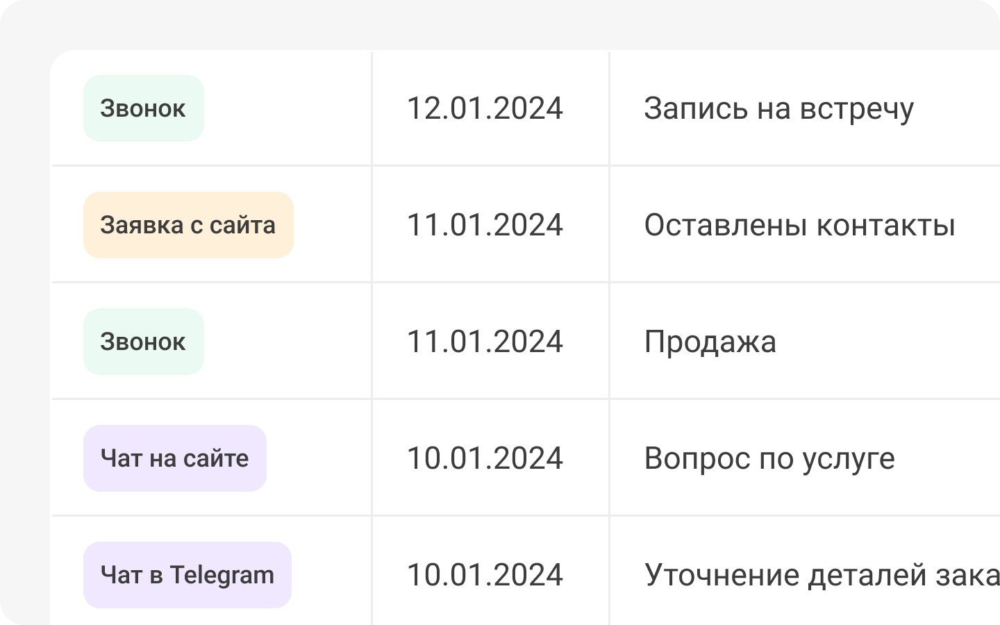

## Что такое лиды?

 
 

 
 

Обычно лидом считается любое обращение в компанию. Это может быть заявка с формы на сайте, звонок, сообщение в чате или любое другое целевое действие, которое важно в вашем бизнесе.

 
 

<button b_to="/calltracking/4Screen.md" b_type="fill" b_theme="primary">Продолжить</button>
<button b_to="/calltracking/2Screen.md" b_type="outline" b_theme="secondary">Назад</button>