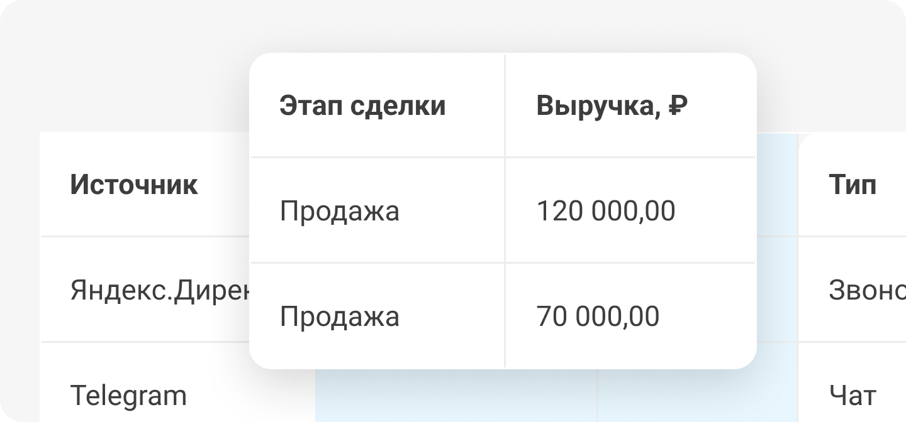

 
 

## Целевой лид по этапу сделки или истории

 
 

Связать лид и этап его сделки с источником можно при помощи интеграции с CRM. В момент загрузки данных из вашей CRM в UIS этапы сделок можно превратить в теги и отобразить их в отчетах.

 
 

 
 

Также вы можете вручную определять качество лидов, слушая записи разговоров, анализируя источник перехода посетителя и его историю.

 
 

<button b_to="/demo/cpl/7Screen.md" b_type="fill" b_theme="primary">Продолжить</button>
<button b_to="/demo/cpl/5Screen.md" b_type="outline" b_theme="secondary">Назад</button>