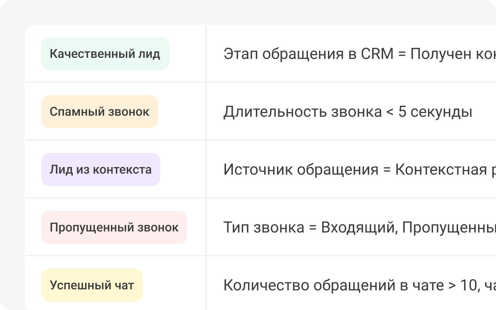

 
 

## Автоматическая разметка лидов

 
 

 
 

Еще один вариант сортировки входящих обращений - установить правила их автоматической разметки в зависимости от типа обращения, времени, источника посетителя, менеджера и многих других. 

 

Например, можно создать и автоматически проставлять тег «Лиды из VK» на все входящие обращения от посетителей из VK. Или помечать как спам все звонки длительностью меньше 5 секунд. 

 
 

<button b_to="/demo/cpl/8Screen.md" b_type="fill" b_theme="primary">Продолжить</button>
<button b_to="/demo/cpl/6Screen.md" b_type="outline" b_theme="secondary">Назад</button>