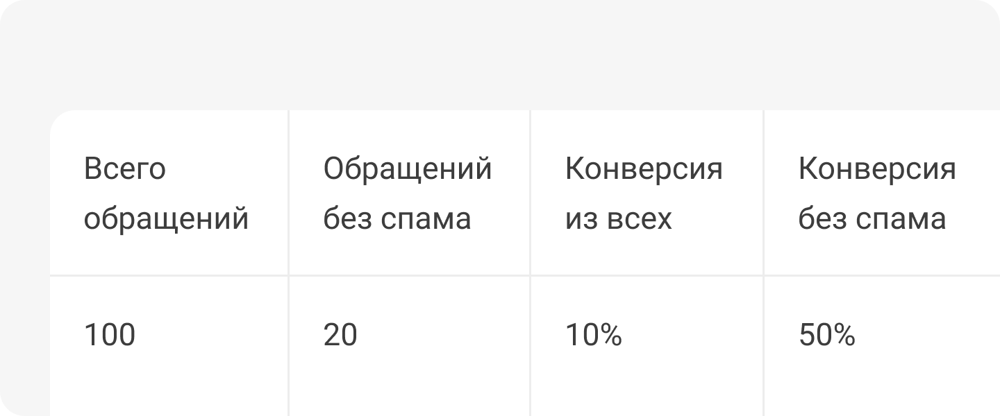

 
 

## Покажем на примере

 
 

 
 

К примеру, мы можем отфильтровать обращения без спама из определенного источника. Столбец с обращениями, в котором не отфильтрованы спам звонки, имеет гораздо более низкую конверсию в покупку по сравнению с тем, где эти звонки отфильтрованы. Из-за этого может создаться ложное впечатление об эффективности источника. 

 
 

<button b_to="/demo/cpl/9Screen.md" b_type="fill" b_theme="primary">Продолжить</button>
<button b_to="/demo/cpl/7Screen.md" b_type="outline" b_theme="secondary">Назад</button>