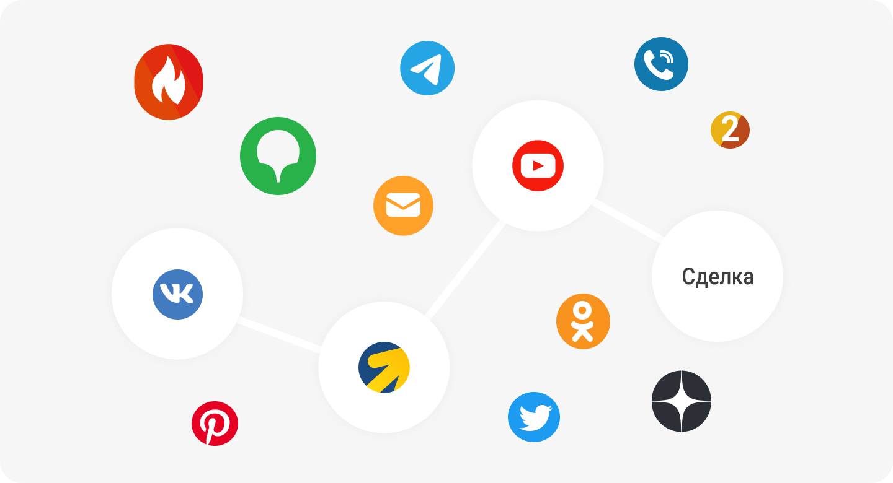

 
 

## Как узнать реальный вклад источника в итоговую конверсию?

 
 

 
 

Перед тем, как сделать покупку, пользователь в среднем делает от 3 до 10 касаний с продуктом. Это может быть просмотр рекламы, чтение поста в социальных сетях или контента на сайте. Как понять, какой канал реально делает вклад в конверсию и куда стоит вкладывать деньги? В этом поможет UIS  и мультиканальная аналитика.

 
 

<button b_to="/demo/createanalitics/2Screen.md" b_type="fill" b_theme="primary">Начать</button>