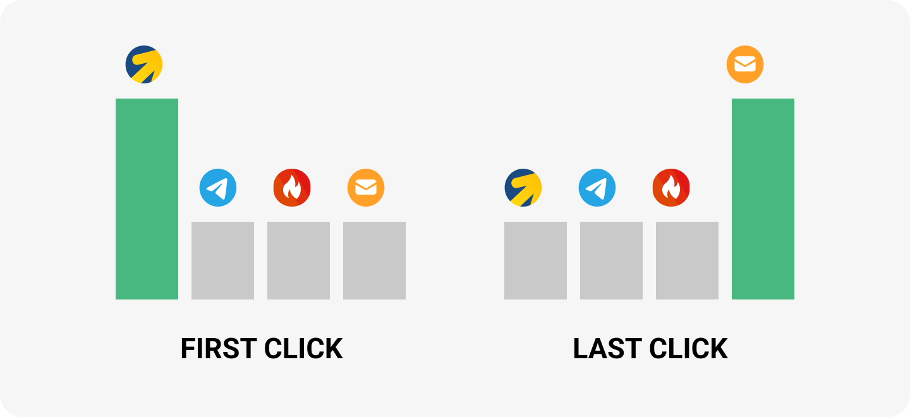

 
 

## Модели атрибуции

 
 

 
 

Алгоритм, который определяет вклад каждого источника в конверсию, называется модель атрибуции. В зависимости от вашего бизнеса, для вас могут иметь большее значение разные касания. Например тот источник, который первым познакомил пользователя с вашим продуктом - в этом случае нужно использовать модель First Click. 

 

В отчетах UIS доступно 8 разных моделей атрибуций. Найти атрибуцию можно в столбцах на пиктограмме. По умолчанию мы считаем метрики по модели Last Click. 

 
 

<button b_to="/demo/createanalitics/5Screen.md" b_type="fill" b_theme="primary">Продолжить</button>
<button b_to="/demo/createanalitics/3Screen.md" b_type="outline" b_theme="secondary">Назад</button>