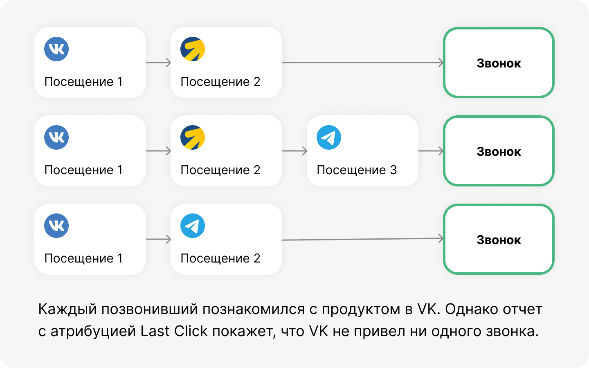

 
 

## Как использовать атрибуцию

 
 

 
 

Атрибуция поможет понять, участвует ли канал в пути клиента и какой его реальный вклад в итоговую конверсию. Иногда кажется, что канал не работает, потому что не приносит заявки напрямую. Но по факту он ассоциировано ведет к вам клиентов, поэтому выключив его, вы рискуете сломать всю цепь.

 
 

<button b_to="/demo/createanalitics/6Screen.md" b_type="fill" b_theme="primary">Продолжить</button>
<button b_to="/demo/createanalitics/4Screen.md" b_type="outline" b_theme="secondary">Назад</button>