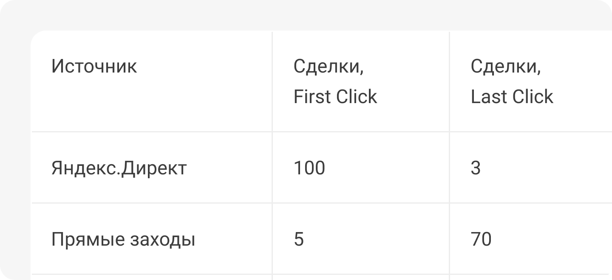

 
 

## Приведем еще один пример

 
 

 
 

На картинке изображены два столбца с заявками, посчитанными по разным моделям атрибуции: First и Last Click. Если смотреть на заявки, посчитанные по модели Last Click, то может показаться, что источник «прямой заход» приносит большинство заявок. Но если присмотреться, то первый клик у всех этих заявок был у источников Я.Директ и SEO, ни одна заявка не пришла с первого клика. 

 

Если мы отключим все источники и оставим только «прямые заходы», то потеряем много заявок - клиентам просто неоткуда будет узнавать о нас.

 
 

<button b_to="/demo/createanalitics/Marketing.md" b_type="fill" b_theme="primary">Продолжить</button>
<button b_to="/demo/createanalitics/5Screen.md" b_type="outline" b_theme="secondary">Назад</button>