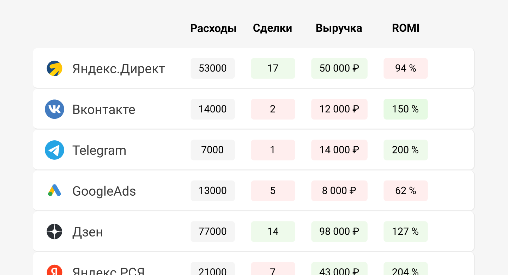

 
 

## Сравнить рекламные источники по сделкам, выручке и ROMI

 
 

Расскажем, как с помощью UIS посчитать и оптимизировать расходы на маркетинг. Откуда собрать все расходы, доходы, как посчитать стоимость лида, рентабельность рекламы ROMI и построить на их основе эффективный маркетинговый план.

 
 

<button b_to="/demo/romi/2Screen.md" b_type="fill" b_theme="primary">Начать</button>