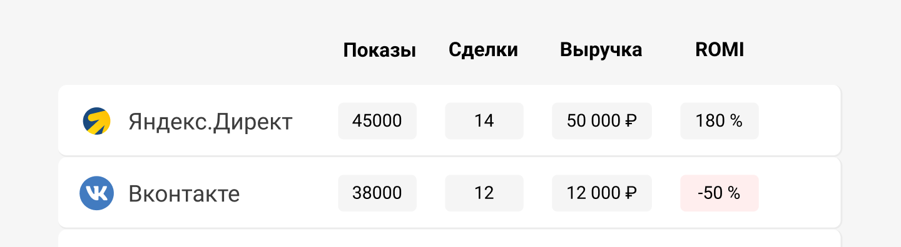

 
 

## Посмотрим на примере

 
 

VK Ads наоборот, имеет ROMI -50%. Мы тратим на него деньги и несем убытки. Но он приводит гораздо больше клиентов, если сравнивать с другими нашими источниками. Если мы сможем понять, как повысить средний чек клиента, то сможем вывести ROMI в плюс и превратить канал в прибыльный и после этого масштабировать его.

 
 

<button b_to="/demo/romi/Marketing.md" b_type="fill" b_theme="primary">Продолжить</button>
<button b_to="/demo/romi/6Screen.md" b_type="outline" b_theme="secondary">Назад</button>