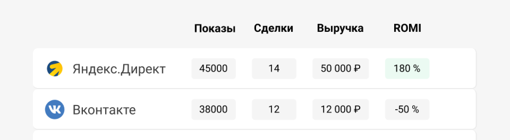

 
 

## Посмотрим на примере

 
 

Рассмотрим на примере данных. У рекламного источника Я.Директ ROMI 180%, это значит что на каждый затраченный рубль мы получаем 1,8 рубля прибыли. Но увеличив бюджет, мы не получили большее количество сделок и понизили окупаемость - потому что мы уже получаем всех доступных клиентов из этого источника.

 
 

<button b_to="/demo/romi/step6.md" b_type="fill" b_theme="primary">Продолжить</button>
<button b_to="/demo/romi/step4.md" b_type="outline" b_theme="secondary">Назад</button>