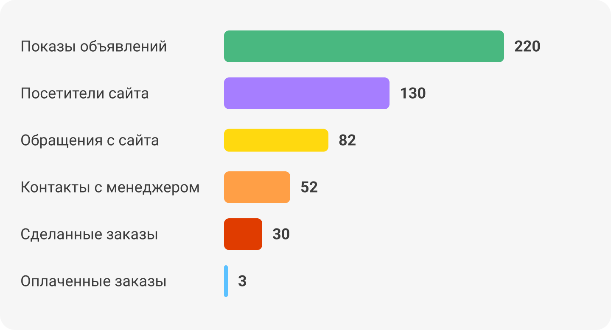

 
 

## Что такое конверсия

 
 

 
 

Конверсия – это количество людей, которые совершили определенное действие на нашем сайте или в приложении, по сравнению с общим числом посетителей. Например, сколько людей, которые заполнили форму заявки, в итоге купили наш продукт. Это может быть любое действие, которое важно для нашего бизнеса: переход на определенную страницу, добавление товара в корзину, заполнение заявки. 

 
 

<button b_to="/demo/utm/3Screen.md" b_type="fill" b_theme="primary">Продолжить</button>