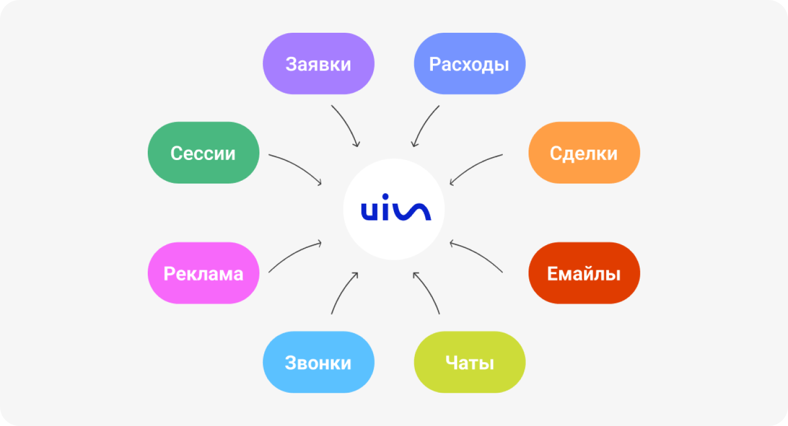

## Данные по каждому этапу

 
 

 
 

UIS - это система аналитики и управления коммуникациями. Она не только собирает информацию о посетителях сайта, но и связывает каждое их обращение (заявку, звонок или чат) с рекламным источником. Мы можем брать данные из рекламных систем или CRM, чтобы увидеть весь путь клиента: от первого касания с продуктом до совершения сделки.

 
 

<button b_to="/calltracking/4Screen.md" b_type="fill" b_theme="primary">Продолжить</button>
<button b_to="/calltracking/2Screen.md" b_type="outline" b_theme="secondary">Назад</button>