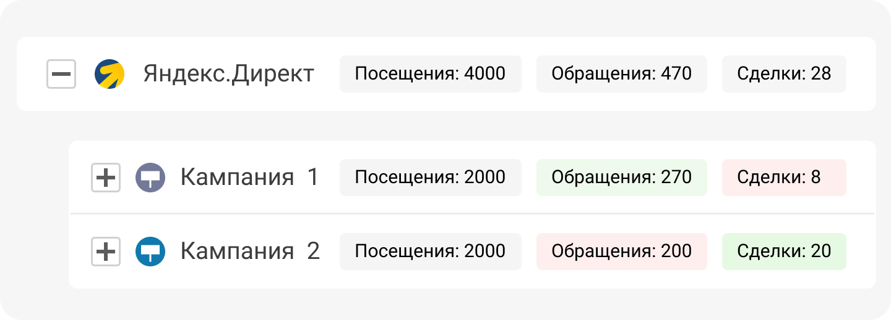

## Посмотрим на примере

 
 

 
 

Приведем пример на источнике Яндекс.Директ. В нем у нас есть несколько рекламных кампаний, у каждой из которых разная эффективность. Первая кампания имеет конверсию в обращение __15%__, но приводит мало конверсий в покупку - всего __3%__.

 

Но вторая рекламная кампания при такой же конверсии в обращение имеет конверсию в покупку гораздо выше, __10%__. Это значит, что вторая кампания ведет к нам больше реальных клиентов.

 

<button b_to="/calltracking/7Screen.md" b_type="fill" b_theme="primary">Продолжить</button>
<button b_to="/calltracking/5Screen.md" b_type="outline" b_theme="secondary">Назад</button>