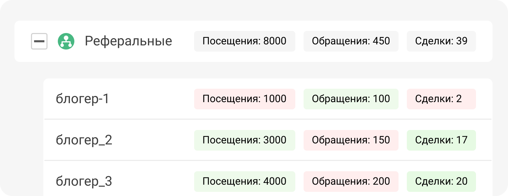

 
 

## Посмотрим на примере

 
 

 
 

Другой пример: у нас есть одна большая брендовая рекламная кампания, которую мы запустили с помощью блогеров и лидеров мнений. Каждый из блогеров использует разные площадки для продвижения своего контента: одну или несколько. Конверсии из таких рекламных кампаний удобно отследить при помощи UTM-меток - так мы увидим, размещение у какого блогера наиболее эффективно.

 

<button b_to="/demo/utm/Marketing.md" b_type="fill" b_theme="primary">Продолжить</button>
<button b_to="/demo/utm/6Screen.md" b_type="outline" b_theme="secondary">Назад</button>