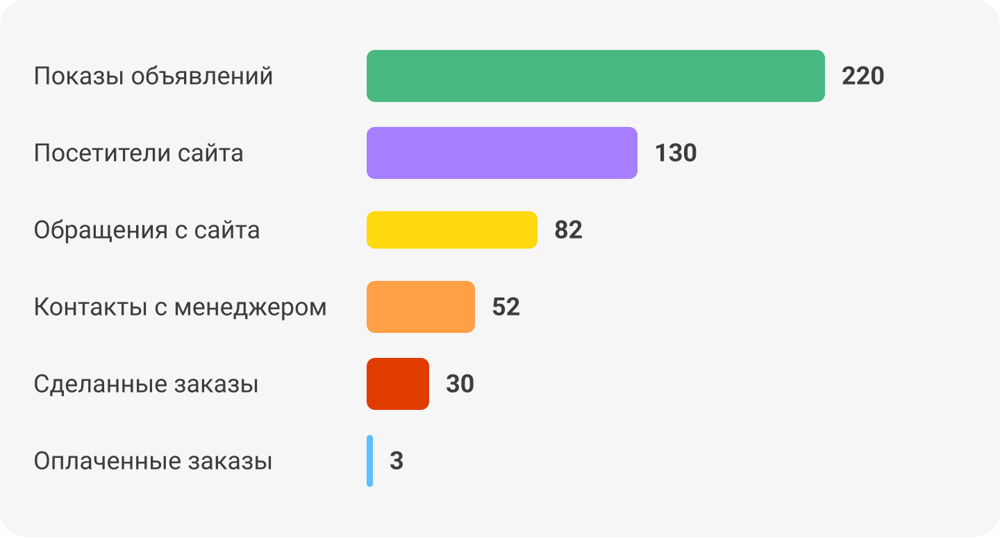

 
 

## Найти узкие места в воронке привлечения и оптимизировать их

 
 

 
 

Расскажем, откуда взять данные, как собрать их в воронку. Зная каждый этап пути клиента и конверсию переходов между ними, вы сможете увидеть, какие рекламные кампании и бизнес-процессы приносят прибыль, а какие пока подбуксовывают и требуют оптимизации.

 
 

<button b_to="/demo/weakplaces/2Screen.md" b_type="fill" b_theme="primary">Начать</button>