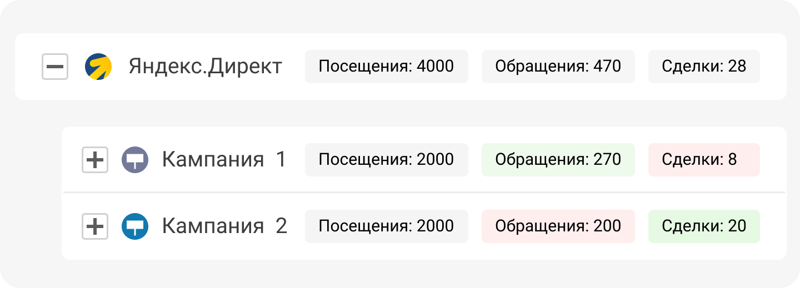

 
 

## Давайте посмотрим на примере

 
 

 
 

Например, рассмотрим источник __Яндекс.Директ__. Внутри источника у нас есть несколько рекламных кампаний и каждая из них имеет разную эффективность. 

 

У первой рекламной кампании конверсия из посещения в обращение выше, чем у второй: __15%__. Но на этапе обработки заявок мы теряем большое количество клиентов. Конверсия изобращения в сделку всего __3%__.

 
 

<button b_to="/demo/weakplaces/6Screen.md" b_type="fill" b_theme="primary">Продолжить</button>
<button b_to="/demo/weakplaces/4Screen.md" b_type="outline" b_theme="secondary">Назад</button>