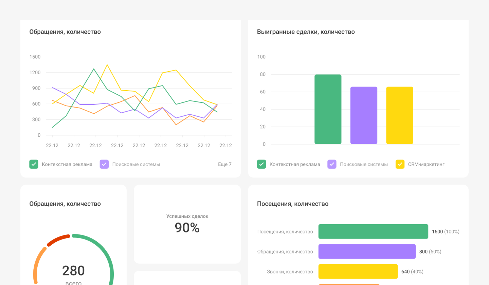

 
 

## Визуализируйте воронку

 
 

 
 

Воронку пути пользователя можно представить в виде наглядных графиков в разделе __Дашборды__. В таком виде удобно следить за динамикой ключевых показателей, показывать метрики коллегам или собирать презентацию для руководителя. Дашборды можно кастомизировать под вашу задачу.

 
 

<button b_to="/demo/weakplaces/Marketing.md" b_type="fill" b_theme="primary">Закончить</button>
<button b_to="/demo/weakplaces/7Screen.md" b_type="outline" b_theme="secondary">Назад</button>