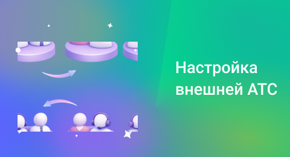

## Внешние АТС

 
 

 
 

Внешняя АТС нужна, когда одной виртуальной АТС UIS недостаточно для обеспечения работы всей телефонии компании. Например, у компании несколько филиалов, подрядчиков или уже настроена существующая инфраструктура, которую сложно изменить. 

 

### Подключение другой АТС UIS

 

Здесь можно подключить другие виртуальные АТС UIS по App ID, чтобы обмениваться сотрудниками и использовать их в отделах и сценариях.

 

Для подключения другой АТС достаточно указать ее App ID и отправить запрос на синхронизацию. Например: АТС 1 отправляет запрос АТС 2. После подтверждения обе стороны могут использовать сотрудников друг друга в сценариях, отделах и т.п.

 
 

<Alert type="info">App ID указан в разделе <a href="/account/basic-information">Основная информация</a></Alert>

 
 

При отправке запроса, со стороны текущей АТС нужно указать:

- внутренний номер, по которому можно отправить звонок в другую АТС;
- правило обработки входящих звонков, пришедших от другой АТС;
- комментарий (чтобы проще ориентироваться в списке).

 

Пока запрос не подтверждён со стороны другой АТС, в списке сторонних АТС будет показан серый кружок со статусом подключения «*Ожидается ответ на запрос о подключении АТС»*. Когда запрос будет подтвержден, статус станет зелёным, если отклонен — красным (тогда можно будет отправить запрос повторно). У принимающей стороны такой запрос тоже появляется в списке, и его можно подтвердить или отклонить. При подтверждении на стороне другой АТС также нужно будет указать свой внутренний номер и правило приёма звонков.

 

После подключения обе стороны могут использовать сотрудников друг друга в своих отделах, сценариях и распределении звонков.

 

Сторонние личные кабинеты АТС UIS можно редактировать из списка или удалить, при условии, что она нигде больше не используется.

 
 

### Подключение сторонней внешней АТС

 

Здесь можно подключить внешнюю АТС через SIP (логин, транк или SIP-URI), чтобы передавать звонки или принимать запросы на исходящие вызовы.

 

- **SIP-логин** — учётная запись для подключения к внешней АТС, которая не привязывается к сотрудникам. Требует регистрации на стороне внешней АТС: сервер, логин и пароль нужно передать ее администратору. Количество каналов зависит от тарифа. Для подключения внешней АТС нужно передать ей логин, пароль и сервер. Если изменить пароль — придётся обновить данные.
- **SIP-транк** — подключение к внешней АТС, не требующее регистрации. Количество каналов зависит от тарифа. Дополнительно можно указать **внутренние номера или диапазоны**, чтобы направлять звонки не только во внешнюю АТС, но и сразу к нужным сотрудникам/отделам.
- **SIP-URI** — направление звонков напрямую по адресу вида *идентификатор@домен*. Используется, если нужно видеть оригинальный номер клиента при переадресации на внешние номера. Регистрация также не нужна.

 

Для всех типов подключения нужно указать название внешней АТС и внутренний номер (чтобы можно было звонить напрямую во внешнюю АТС).

 

Если внешняя АТС подключена через SIP-логин или SIP-транк, она может отправлять UIS запросы на исходящие звонки. В этом случае нужно будет настроить:

- какой номер показывать клиенту при исходящем вызове;
- канальность (сколько одновременных звонков по этому каналу можно принять).

 

Для SIP-транка можно также настроить внутренние номера или целые диапазоны (например, **4XX**) — это нужно, если звонок должен попадать сразу на конкретного сотрудника или отдел.

 

Внешнюю АТС можно редактировать из списка или удалить, при условии, что она нигде больше не используется. В списке АТС подключенные через SIP-логин имеют статусы «ожидает регистрацию» или «зарегистрирован».

 
 
 
 
 
 
