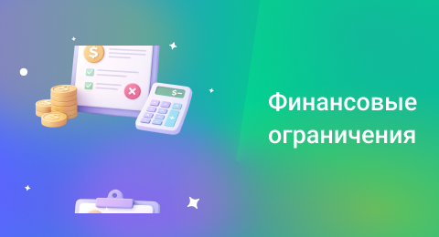

## Финансовые ограничения

 
 

 
 

Установите максимальную стоимость направлений, на которые можно будет звонить и максимальный дневной лимит на звонки. Рекомендуем установить значение максимально дорогих направлений, куда вы совершаете звонки.

 
 

<Alert type="info">Лимиты позволят защитить ваши средства, если к аккаунту получат доступ злоумышленники и попробуют совершить через него международные звонки.</Alert>

 
 

**Запрет на звонки дороже Х ₽/мин** – с помощью этой настройки можно полностью запретить звонки в города и страны, минута звонка в которых стоит больше указанной суммы. Тарифы на связь по России и миру.

 

**Ежедневный лимит на звонки** – максимальная сумма, которую все сотрудники суммарно смогут израсходовать на связь за сутки. Если лимит будет превышен, совершение звонков станет недоступно.

 

**Текущий расход дневного лимита** – показывает, сколько сегодня было уже потрачено на связь. Помогает понять, достигнут ли установленный дневной лимит и сколько ещё доступно до его окончания. Позволяет контролировать расход и избегать неожиданных ограничений.

 

**Максимальный отрицательный баланс** – это предельная сумма, на которую баланс может уйти в минус до того как услуги будут заблокированы. Для изменения этой суммы свяжитесь с вашим менеджером

 

**Текущий баланс** – остаток средств на счете.

 
 
 
 
 
 
