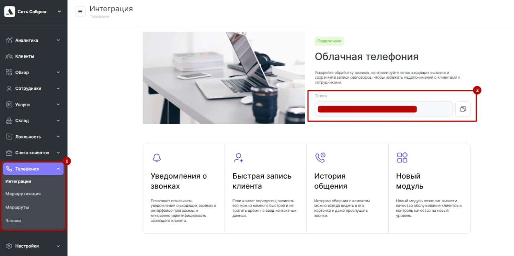
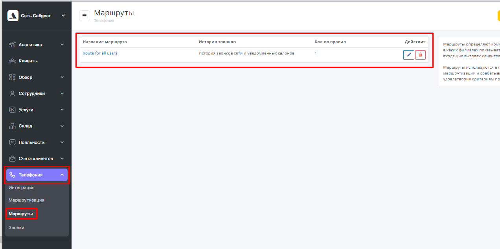

## Altegio - интеграция с телефонией   

**Ценность**    

Интеграция позволяет передавать данные по звонкам из нашего ЛК в Altegio.   

**Функциональность интеграции**   

- всплывающие уведомления о входящих звонках;
- сохранение истории и записей звонков в Altegio.
  

**Подключение интеграции**   

1. Нажмите **"Активен"** на этой странице.  

2. **Сеть** - укажите название сети, с которой подключаете интеграцию. С каждой сетью интеграция подключается отдельно, так как User token в Altegio формируется под каждую сеть.
3. Добавьте **User token** из Altegio в поле **Credential**.   
User token можно получить в Телефония -> Интеграция, поле "Токен".

  

4. **Список виртуальных номеров** - укажите виртуальные номера, по которым необходимо отображать данные по звонкам в Altegio в указанной сети.  
5. Нажмите **сохранить**.  
6. В кабинете Altegio, после проведенных настроек, появятся дополнительные разделы в блоке Сеть –> Телефония:    
Маршрутизация, Маршруты и Звонки (1), а статус интеграции изменится на Интеграция подключена (2)

 

7. В Altegio перейдите в раздел **Маршруты** и выстроите маршрут, по которому будет идти звонок.  
Маршрут по умолчанию всего один – Маршрут для всех пользователей.  
Настройка маршрута по умолчанию – сохранять историю звонков по маршруту в Истории сети. 

   

Кликните, чтобы открыть настройки.  

  

При такой настройке всплывающие уведомления о звонках работать не будут, а звонки будут видны только в истории звонков сети.   
**Измените настройку** на ту, которая вам подходит:  
  - история звонков сети и всех салонов – всплывающее окно о звонке будет появляться во всех филиалах сети, звонок будет виден во всех филиалах в разделе Обзор – Звонки. 
  - история звонков сети и уведомленных салонов – всплывающее окно о звонке будет появляться в том филиале/филиалах, которые будут выбраны в этом маршруте.  
  
8. После настройки маршрута свяжите его с номером телефона/идентификатором абонента телефонии, sip, на который поступают звонки.  
Для этого перейдите в раздел **Маршрутизация**.
   
Укажите номер телефона своей компании без плюса, скобок, дефисов, пробелов и других символов и сохраните.  
Настройка в  Altegio завершена.  
 

Для проверки работы интеграции на тестовых звонках проверьте работы пунктов указаных в **"Функциональность интеграции"**.  
Если после всех настроек звонки в Altegio не появляются, проверьте, совпадают ли номера телефонов в маршрутизации Altegio и нашем Личном кабинете.
