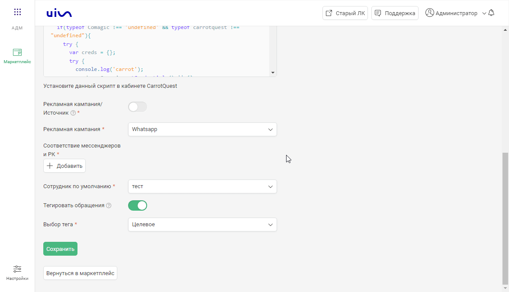
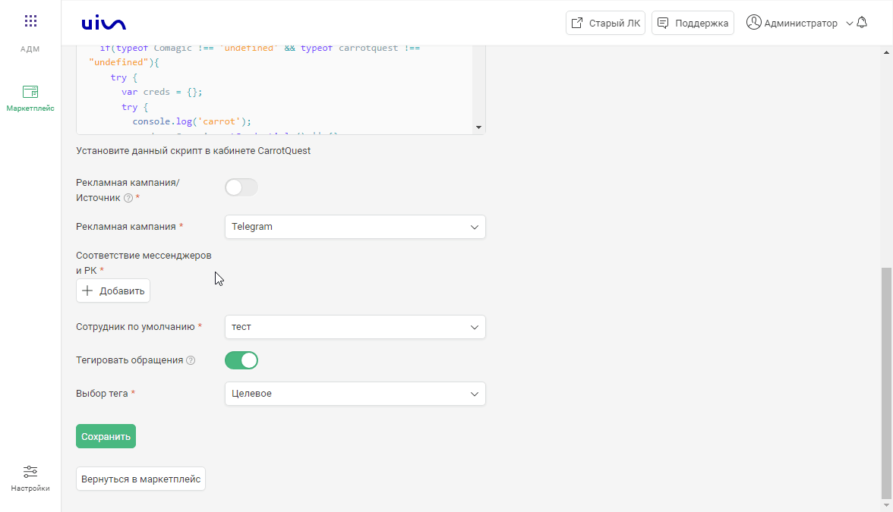

### CarrotQuest. Передача чатов  
 

**Ценность интеграции**  
Интеграция позволяет получать данные по чатам в наш кабинет для построение аналитики.  
 

**Возможности интеграции**  
1. Передача чатов из виджета CarrotQuest.  
2. Передача чатов мессенджеров из виджета CarrotQuest.  
3. Принудительная загрузка чатов в одну настроенную РК или источник.  
 

**Какие данные передаются**  
- контактные данные (имя,телефон,email).  
- дата и время создания.  
- данные сессии (рекламную кампанию, источник, UTM-метки и тд).  
- в случае отсутствия сессии, дефолтную РК или источник.  
 

  **Необходимые кампоненты для работы интеграции**  
- Загрузка чатов из внешней системы.
 

**Настройка интеграции**  
1. Нажмите "Активен" на этой странице.
2. Выполните настройки интеграции.  

  
 Настройте Webhook в CarrotQuest 
  
В CarrotQuest необходимо настроить Webhook на "Webhook url" сервиса CoMagic/UIS из настроек.   
a. Заходим в  CarrotQuest в раздел Интеграции -> Интеграции своими руками , создаем интеграцию Webhooks.   
b. В поле URL вставляем скопированный адрес, в поле "События" выбираем "Вопрос диалога разрешен".  
c. Нажимаем "Сохранить".
  

 
  

  
 Настройте JS Script в CarrotQuest 
  
В CarrotQuest необходимо настроить JS Script сервиса CoMagic/UIS из настроек.   
a. Заходим в  CarrotQuest в раздел Интеграции -> Интеграции своими руками , создаем интеграцию JS Script.   
b. В поле "Скрипт" вставляем скопированный скрипт.  
c. Нажимаем "Сохранить".
  

 
 

- **Авторизация в CarrotQuest**  
В поле Ваш ключ API CarrotQuest вводим ключ АПИ CarrotQuest.  

  
Как получить ключ АПИ в CarrotQuest.   

  
  

- В поле **Сотрудник по умолчанию** выбираем сотрудника на которого будут назначаться чаты.
- **Рекламная кампания/источник** — необходимо выбрать какую сущность использовать для обращений без сессии. По умолчанию выбрана Рекламная кампания (маркер не прожат), при прожатии маркера выбирается Источник.
- В зависимости от положения переключателя "Рекламная кампания/источник" выводится либо список рекламных кампаний из личного кабинета клиента, либо список источников и сайтов. Необходимо указать какую **Рекламную кампанию/источник и сайт** используем в случае отсутствия сессии. 
  
- В разделе **Сопоставление источников/Сопоставление рекламных кампаний** выбираем сопоставление каналов мессенджеров с Рекламными кампаниями/Источниками.  

- **Тегировать обращения** — при прожатии появится возможность выбрать тег, который будет ставится на все чаты интеграции.
  
3. Нажмите сохранить.  
Для проверки работы интеграции оставьте тестовый чат и проверьте его попадание в личный кабинет.  
