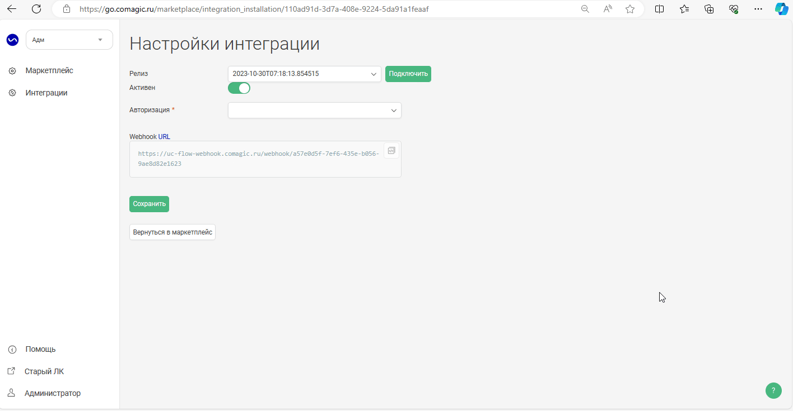

## Интеграция с МойСклад    

**Ценность**     

Решение позволяет передавать в наш кабинет данные по сделкам, для дальнейшего построения Сквозной аналитики.   

**Какие данные передаются**    

Данные получаемые по сделкам:     
- сделки: сумма сделки, статус, магазин, к которому относится сделка и тд; 
- воронка продаж и ее этапы;
- контакты.

Данные передаваемые по звонкам:   
- всплывающие уведомления о звонках;
- статистика и запись разговора;
- звонок в один клик из CRM.    
  
   
 
 
 

## Подключение передачи сделок    
 

 
 Шаги по подключению 
  

1. Прожмите переключатель "МойСклад - передача сделок", для активации интеграции.  
2.  **Авторизация в МойСклад**  

Добавьте название авторизации, а также логин и пароль, от МойСклад.

 

3. Нажмите сохранить.  
  
После подключения интеграции сделки будут попадать в  Сырые данные -> Сделки.     
Для проверки корректности работы интеграции создайте тестовую сделку в МойСклад .    

 
 
 
 
 
 
 
 

## Подключение телефонии    

 
 Шаги по подключению 
  

1. Прожмите переключатель "МойСклад - телефония", для активации интеграции.  
2. Подключите в МойСклад модуль UIS.  
 - Перейдите в раздел **Приложения** и если ни одного приложения не подключено, нажмите **Выбрать приложение**.
 - В открывшемся разделе найдите ниже **Телефония — UIS** и нажмите Установить.
 - В появившемся окне настроек:  
   - В поле **Адрес провайдера телефонии** вставьте URL из поля **Webhook URL** из наших настроек.
   - Скопируйте ключ из поля **Ключ доступа** (он потребуется далее).
   - Введите внутренние номера сотрудников, соответствующие внутренним номерам в Личном кабинете UIS.
   - Прожмите **Установлено**.
   - Сохраните настройку.  
   
   
     
3. **Авторизация в МойСклад**  

- Добавьте название авторизации.
- Добавьте Token, скопированный из параметра **Ключ доступа** приложения МойСклад.
     
 

4. **Показывать внутренние звонки** - выберете настройку, если в МойСклад необходимо фиксировать звонки между сотрудниками.  
   
5. Нажмите сохранить.  

Для проверки работы интеграции на тестовых звонках проверьте работы пунктов указаных в **"Данные передаваемые по звонкам"**.  

 
