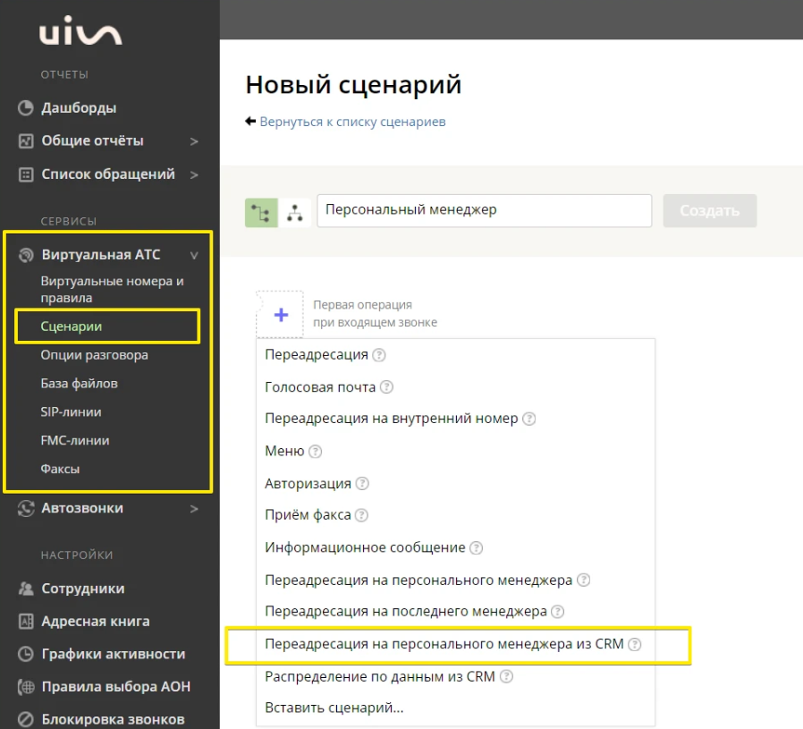

# Интеграция с amoCRM    

Решение позволяет передавать в наш кабинет данные по сделкам, для дальнейшего построения Сквозной аналитики, а также интегрировать функционал телефонии и передавать данные по звонкам и текстовым коммуникациям в соответствии с выбранными настройками в amoCRM.
 
 
 
 

## Функционал интеграции    

 

### Телефония  

- встроенный виджет для звонков;
- соединение звонящего с персональным менеджером;
- синхронизация сотрудников;
- автоматическое создание контактов/сделок при входящих и исходящих звонках;
- автоматическое создание задач при пропущенных звонках;
- исходящие звонки из CRM по клику на номер контакта;
- прослушивание записей звонков в amoCRM.
    

### Чаты и офлайн-заявки  

- передача в CRM чатов и заявок с сайта;
- синхронизация сотрудников;
- встройка виджета РМО UIS в кабинет amoCRM;
- автоматическое создание контактов/сделок/неразобранного;
- автоматическое создание задач;
- передача дополнительных полей в контакт/сделку;
- простановка тегов.  

### Сквозная аналитика  

Импорт данных о сделках из CRM в «Сводный отчет» и в отчет «Сырые данные — Сделки» :

- сделки: сумма сделки, доп. поля, источник из CRM и тд;
- воронка продаж и ее этапы;
- контакты;
- ответственный менеджер.

 
 
 
 

## Подключение учетной записи  

 
 Шаги по подключению 
  

Для авторизации в amoCRM необходимо в ЛК UIS:    
- нажать "Авторизация";
- если ранеее добавляли учетные данные amoCRM, то выбрать их из списка;   
- если нет, то нажать "Добавить учетные данные".
  
   

Откроется окно для ввода данных портала, который вам нужно подключить.
- В поле "Название" можно ввести любое понятное вам название, тк оно будет отображаться в выпадающем списке.
- В поле "AmoCRM URL" необходимо вставить ссылку на ваш портал AmoCRM, например: https://uismarketplace.amocrm.ru/.
- Нажмите кнопку "Подключить".

   

Откроется страница amocrm для подключения портала и передачи доступа к нему UIS Чатам. Выберите нужный аккаунт и нажмите "Разрешить".   
 

<Alert type=warning> Если данная страница не открылась, то нажмите на круглую стрелочку напротив поля с вашим порталом в настройках интеграции. </Alert>   

     

Далее, откроется страница с сообщением что портал успешно подключен и закроется автоматически.
    
  

<Alert type=warning> Также есть возможность отредактировать или удалить учетные данные которые вы установили. Для этого, в окне "Учетных данных" в выпадающем списке, при наведении курсора на портал - справа появляется иконка "шестеренки", при нажатии на которую открывается окно, где можно отредактировать и сохранить изменения, либо удалить эти данные. </Alert>   
    
    

      
После добавления учетных данных на странице появятся Параметры интеграции.   

 

 
 
 
 

## Синхронизация сотрудников  

 
 Шаги по подключению 
  
Для синхронизации сотрудников из amoCRM в UIS прожмите свитч активации интеграции "Синхронизация сотрудников".    

1. **Синхронизировать всех сотрудников** - выберите настройку, если требуется импортировать всех сотрудников из amoCRM в UIS. При отключении настройки становится доступным список сотрудников для синхронизации.    

2. Выберите конкретных сотрудников в настройке **Сотрудники для синхронизации**, если требуется синхронизировать не всех сотрудников из amoCRM.    

3. Нажмите кноку **Синхронизировать сотрудников** для ручной синхронизации сотрудников. (при первом подключении обязательное действие) 
По умолчанию синхронизируем сотрудников после активации интеграции раз в сутки в ночь.

 

 
 
 
 

## Телефония  

 
 Шаги по подключению 
  

Для передачи звонков из UIS в amoCRM прожмите свитч активации интеграции "Телефония".    

## Основное   

1. **График работы компании** - выберите график работы компании из предложенного списка.     
Настройка будет учитываться при создании задач.  

2. **Фильтровать звонки**  - выберите настройку, если требуется фильтровать звонки. При включенной настройке становятся активными кнопки **Фильтры входящих** и **Фильтры исходящих**.

При нажатии на кнопку открывается модальное окно с настройкой, чтобы появились поля фильтра нужно нажать на кнопку **И/ИЛИ**.   

- В поле **Параметр** выберите требуемый параметр для фильтрации звонков .  
- В поле **Условие** можно выбрать **Включить** или **Исключить**:   

    - При выборе **Включить** - система будет пропускать входящие обращения и создавать сущности.
    - При выборе **Исключить** - система не будет создавать сущности при входящем обращении с выбранного источника.   

Также доступна более гибкая настройка с логическими операциями **И/ИЛИ** - при которой будет идти более гибкая фильтрация входящих/исходящих обращений.   

**Например**: включить для создания сущностей входящие обращения с сайта И/ИЛИ виртуального номера.    

   

3. **Входящие звонки**

- **Первичные обращения** -  выберите требуемый способ обработки входящих звонков с новых, еще неизвестных номеров.   
- **Повторные обращения** -  выберите требуемый способ обработки входящих звонков от существующих контактов.  
- Если в повторных обращениях выбран вариант **Создавать сделку, если нет активных**, становится активной настройка **Создавать сделку после закрытия последней не ранее, чем через**. Укажите в ней интервал времени, через который требуется создавать новую сделку, после закрытия последней.   
- **Переадресация на ответственного сотрудника** - выберите из какой сущности требуется брать ответственного сотрудника при переадресации.    
Для автоматического соединения звонящего с персональным менеджером в amoCRM используйте операцию сценария **Переадресация на персонального менеджера из CRM**.   

   

Не забудьте настроить выходы:
- Персональный CRM менеджер не назначен — звонок будет направлен в эту ветку, если у звонящего еще нет персонального менеджера
- Переадресация не удалась — эта ветка сработает, если персональный менеджер не ответил на вызов.    

4. **Исходящие звонки**

- **Первичные обращения** -  выберите требуемый способ обработки входящих звонков с новых, еще неизвестных номеров.   
- **Повторные обращения** -  выберите требуемый способ обработки входящих звонков от существующих контактов.  
- Если в повторных обращениях выбран вариант **Создавать сделку, если нет активных**, становится активной настройка **Создавать сделку после закрытия последней не ранее, чем через**. Укажите в ней интервал времени, через который требуется создавать новую сделку, после закрытия последней.  
- **Назначать при потерянном звонке**- выберите кого назначать ответственным за сделку, контакт при потерянном исходящем звонке.  

5. **Задачи**   

- Вы можете включить автоматическое создание задач при успешных входящих/исходящих, а также потерянных входящих/исходящих звонках и задать, **на кого назначать** эти задачи:
 - на менеджера из карточки контакта в amoCRM;
 - на менеджера из карточки сделки в amoCRM;
 - на ответственного сотрудника, установленного в настройках интеграции;
 - для исходящих, на сотрудника, совершившего вызов.   

- **Срок задачи** - выберите временной промежуток, который необходимо указывать в качестве срока задачи.   
При простановке срока задачи учитывается выбранный **График работы компании**.   

6. **Для успешных назначать на** - выберите кого назначать ответсвенным менеджером за сделку/контакт при успешном звонке.   
 
 

## Шаблоны   

Для настройки наименований создаваемых сущностей доступны поля: "Контакты", "Сделки", "Задачи". В каждом поле можно задавать любые нужные вам наименования, используя переменные значения, через кнопку плюса под полем.  

    

1. Нажав на кнопку плюса, можно выбрать, какое значение переменной установить в шаблон наименования сущности.     

2. Кнопка с иконкой (глаза) дает возможность сделать предпросмотр наименования которое будет отображено в создаваемой сущности.     

3. Кнопка с иконкой (закругленой стрелочки) возвращает шаблон поля к последнему сохраненному значению.   

 

<Alert type=warning> Обратите внимание: что название шаблонов, которые вы задаете относятся только к сущностям сделок, контактов и задач в amoCRM. К записям, создаваемых в "Не разобранном" - они не применяются. </Alert>   

 
  

## Мультиворонки   

Мультиворонки позволяют создавать сделки в разных воронках.   

Вкладка **Мультиворонки** становится доступна, при выборе метода передачи "Создавать сделку и контакт" во вкладке **Основное**.    

1. Задайте необходимую воронку и этап по умолчанию - это обязательные поля.  

2. Для добавлении условия попадания сделки в воронку нажмите кнопку "Добавить".  
- Сначала выберите воронку, а затем этап этой воронки. 
- Далее выберите условия или группы условий для определения правил, по которым будут создаваться сделки по обращениям в выбранную воронку.
- Нажмите "Сохранить".   

    Условия:   

    - **Включить** - при выборе данного условия, подпадающее под это условие обращение будет обработано и помещено в воронку выбранную с этим фильтром. Все остальные обращения, которые под это условие не подпадают будут отправлены в воронку и этап по-умолчанию.  
    - **Исключить** - тут работает наоборот, при выборе данного условия, попадающее под это условие обращение будет обработано и помещено в воронку по-умолчанию. Все остальные обращения, которые под это условие не подпадают будут отправлены в воронку и этап выбранные в фильтре.  

     

Синхронизация с amoCRM и обновление воронок происходит при обновлении страницы настроек интеграции после добавления новой воронки или этапа в amoCRM.  
 

<Alert type=error> Если у вас выбрано создание в "Неразобранном", то при таких настройках запись в неразобранном будет создана в первой воронке из списка ваших воронок в amoCRM, даже если выбрана по-умолчанию воронка. Также, фильтры не работают с неразобранным. </Alert>  

 
  

## Ответственные    

Настройка позволяет управлять назначением ответственных сотрудников за сущности в зависимости от условий.  

1. Задайте ответственного по умолчанию - это обязательное поле.  

2. Для добавлении условия назначения ответственного нажмите кнопку "Добавить" в основных условиях.  
- Выберите сотрудника из выпадающего списка. 
- Далее выберите условия или группы условий для определения правил, по которым будут проставляться ответственные в создаваемых сущностях по обращениям.
- Нажмите "Сохранить".   

    

  
  

## Дополнительные поля    

Настройка позволяет передавать дополнительные поля в контакт и сделку.

1. Сопоставьте для каждой сущности дополнительные поля из amoCRM и UIS. 

2. После добавления сопоставления всех требуемых дополнительных полей - нажмите "Сохранить". 

    
 

<Alert type=warning> При добавлении нового поля в amoCRM для корректной работы следует выбирать тип поля в amoCRM "Текст", чтобы не было ошибок при использовании доп полей. </Alert>  

  

 
 
 
 
 
 
 

## Чаты  

 
 Шаги по подключению 
  

Для передачи чатов из UIS в amoCRM прожмите свитч активации интеграции "Чаты".    

## Основное   

1. **Канал** - выберите из списка каналы, при написании в которые у вас будут создаваться сущности в amoCRM.   

2. **Метод передачи** - выберите требуемый способ обработки чатов.      

Варианты обработки:   

- **Создавать контакт и сделку**. При первичном контакте, для клиента будет создан контакт и сделка. При повторном обращении - будет создана только сделка, при условии, что у клиента нет сделок в активной воронке, либо сделок не существует в воронке совсем.

- **Использовать "Неразобраное"**. Будет всегда создавать запись в неразобраном. Запись будет создаваться каждый раз, когда чат уже закрыт, и приходит новое сообщение от клиента.    

3. **Создавать задачу** - выберите настройку, если требуется создание задач по чатам. При включении настройки, появляются дополнительные поля:    

    - **Срок задачи** - выберите временной промежуток, который необходимо указывать в качестве срока задачи.   

    - **Создавать задачу на сотрудника**:   
        - **Из карточки контакта** - задача будет ставится на сотрудника, который указан в карточке контакта в amoCRM.
        - **Из настроек интеграции** - задача будет ставится на сотрудника, который указан в настройках интеграции в блоке "Сотрудники" в поле "Ответственный по-умолчанию".   

4. **Фильтрация чатов** - задайте условия, если требуется фильтровать чаты по сайтам, рекламным кампаниям и проч.  

При нажатии на кнопку  **Фильтрация чатов**  открывается модальное окно с настройкой, чтобы появились поля фильтра нужно нажать на кнопку **И/ИЛИ**.   

- В поле **Параметр** сейчас доступны варианты фильтрации: Сайт или Рекламная компания.  
- В поле **Условие** можно выбрать **Включить** или **Исключить**:   

    - При выборе **Включить** - система будет пропускать входящие обращения и создавать сущности.
    - При выборе **Исключить** - система не будет создавать сущности при входящем обращении с выбранного источника.   

Также доступна более гибкая настройка с логическими операциями **И/ИЛИ** - при которой будет идти более гибкая фильтрация входящих обращений.   

**Например**: исключить для создания сущностей входящие обращения с сайта И/ИЛИ с канала телеграм.       

   

5. **Проставлять теги**  - при выключенной настройке теги не будут ставиться на сущности amoCRM. И также, скрыто поле "Список тегов".  

При включении настройки - появляется поле "Список тегов". Оно содержит фиксированный список тегов, доступный для выбора.   
При выборе тегов, проставляться они будут как на сущность сделки, так и на сущность контакта при их создании.

 
 

## Шаблоны   

Для настройки наименований создаваемых сущностей доступны поля: "Контакты", "Сделки", "Задачи". В каждом поле можно задавать любые нужные вам наименования, используя переменные значения, через кнопку плюса под полем.  

    

1. Нажав на кнопку плюса, можно выбрать, какое значение переменной установить в шаблон наименования сущности.     

2. Кнопка с иконкой (глаза) дает возможность сделать предпросмотр наименования которое будет отображено в создаваемой сущности.     

3. Кнопка с иконкой (закругленой стрелочки) возвращает шаблон поля к последнему сохраненному значению.   

 

<Alert type=warning> Обратите внимание: что название шаблонов, которые вы задаете относятся только к сущностям сделок, контактов и задач в amoCRM. К записям, создаваемых в "Не разобранном" - они не применяются. </Alert>   

 
   

## Мультиворонки   

Мультиворонки позволяют создавать сделки в разных воронках.   

Вкладка **Мультиворонки** становится доступна, при выборе метода передачи "Создавать сделку и контакт" во вкладке **Основное**.    

1. Задайте необходимую воронку и этап по умолчанию - это обязательные поля.  

2. Для добавлении условия попадания сделки в воронку нажмите кнопку "Добавить".  
- Сначала выберите воронку, а затем этап этой воронки. 
- Далее выберите условия или группы условий для определения правил, по которым будут создаваться сделки по обращениям в выбранную воронку.
- Нажмите "Сохранить".   

    Условия:   

    - **Включить** - при выборе данного условия, подпадающее под это условие обращение будет обработано и помещено в воронку выбранную с этим фильтром. Все остальные обращения, которые под это условие не подпадают будут отправлены в воронку и этап по-умолчанию.  
    - **Исключить** - тут работает наоборот, при выборе данного условия, попадающее под это условие обращение будет обработано и помещено в воронку по-умолчанию. Все остальные обращения, которые под это условие не подпадают будут отправлены в воронку и этап выбранные в фильтре.  

     

Синхронизация с amoCRM и обновление воронок происходит при обновлении страницы настроек интеграции после добавления новой воронки или этапа в amoCRM.  
 

<Alert type=error> Если у вас выбрано создание в "Неразобранном", то при таких настройках запись в неразобранном будет создана в первой воронке из списка ваших воронок в amoCRM, даже если выбрана по-умолчанию воронка. Также, фильтры не работают с неразобранным. </Alert>  

 
  

## Сотрудники    

Настройка позволяет управлять назначением ответственного по умолчанию, а также синхронизировать сотрудников из портала amoCRM в личный кабинет UIS.  

1. **Ответственный сотрудник по-умолчанию** - поле благодаря которому, система будет устанавливать ответственным в контакте, сделке и задачах, выбранного в этом поле сотрудника.  

2. **Синхронизация по расписанию** - при включении, синхронизация сотрудников будет происходить автоматически каждый день в полночь.   

3. **Синхронизировать сотрудников** - кнопка для ручной принудительной синхронизации сотрудников.   

    

  
  

## Дополнительные поля   

Настройка позволяет передавать дополнительные поля в контакт и сделку при их создании.

1. Сопоставьте для каждой сущности дополнительные поля из amoCRM и UIS. 

2. После добавления сопоставления всех требуемых дополнительных полей - нажмите "Сохранить". 

    
 

<Alert type=warning> При добавлении нового поля в amoCRM для корректной работы следует выбирать тип поля в amoCRM "Текст", чтобы не было ошибок при использовании доп полей. </Alert>  

  
 

 

 
 
 
 

## Офлайн-заявки  

 
 Шаги по подключению 
  

Для передачи заявок из UIS в amoCRM прожмите свитч активации интеграции "Офлайн-заявки".    

  

## Основное   

1. **График работы компании** - выберите график работы компании из предложенного списка.     
Настройка будет учитываться при создании задач.    

2. **Метод передачи**- выберите требуемый способ обработки заявки.      

- Если выбрана Обрабатывать вручную - не создаются нижеперечисленные сущности. 
- При выборе Использовать функционал «Неразобранное» заявка на сделку в Неразобранном будет создаваться всегда при поступлении заявки. 
- Если выбраны способы Создавать контакт или Создавать сделку и контакт, то сделка будет создаваться всегда, а контакт — только если обращение первичное.     

3. **Только для первичных обращений** - параметр активирует обработку только первичных обращений тем способом, который был указан ранее.     

4. **Создавать задачу на сотрудника** - для любой поступившей заявки можно настроить автоматическое создание задач.    

Если в параметре "Создавать задачу на сотрудника" выбран вариант "Не создавать" - задачу не создаем , иначе создаем задачу на ответственного сотрудника в соответствии с настройками ниже.  

5. **Срок задачи** - выберите временной промежуток, который необходимо указывать в качестве срока задачи.   

При простановке срока задачи учитывается выбранный **График работы компании**.   

6. **Фильтрация заявок** - задайте условия, если требуется фильтровать заявки по сайтам, типам и проч. 

При нажатии на кнопку **Фильтрация заявок** открывается модальное окно с настройкой, чтобы появились поля фильтра нужно нажать на кнопку **И/ИЛИ**.   

- В поле **Параметр** выберите требуемый параметр для фильтрации заявок .  
- В поле **Условие** можно выбрать **Включить** или **Исключить**:   

    - При выборе **Включить** - система будет пропускать входящие обращения и создавать сущности.
    - При выборе **Исключить** - система не будет создавать сущности при входящем обращении с выбранного источника.   

Также доступна более гибкая настройка с логическими операциями **И/ИЛИ** - при которой будет идти более гибкая фильтрация входящих обращений.   

**Например**: исключить для создания сущностей входящие обращения с сайта И/ИЛИ с типа формы DataAPI.      

   

7. **Проставлять теги** - при выключенной настройке теги не будут ставиться на сущности amoCRM. И также, неактивно поле "Списка тегов".  

При включении настройки - активируется поле "Список тегов". Оно содержит фиксированный список тегов, доступный для выбора.   
При выборе тегов, проставляться они будут как на сущность сделки, так и на сущность контакта при их создании.

  
  

## Шаблоны   

Для настройки наименований создаваемых сущностей доступны поля: "Контакты", "Сделки", "Задачи". В каждом поле можно задавать любые нужные вам наименования, используя переменные значения, через кнопку плюса под полем.   

     

1. Нажав на кнопку плюса, можно выбрать, какое значение переменной установить в шаблон наименования сущности.     

2. Кнопка с иконкой (глаза) дает возможность сделать предпросмотр наименования которое будет отображено в создаваемой сущности.     

3. Кнопка с иконкой (закругленой стрелочки) возвращает шаблон поля к последнему сохраненному значению.   
 

<Alert type=warning> Обратите внимание: что название шаблонов, которые вы задаете относятся только к сущностям сделок, контактов и задач в amoCRM. К записям, создаваемых в "Не разобранном" - они не применяются. </Alert>   

  
  

## Мультиворонки    

Мультиворонки позволяют создавать сделки в разных воронках.

Вкладка **Мультиворонки** становится доступна, при выборе метода передачи "Создавать сделку и контакт" во вкладке **Основное**.    

1. Задайте необходимую воронку и этап по умолчанию - это обязательные поля.  

2. Для добавлении условия попадания сделки в воронку нажмите кнопку "Добавить" в основных условиях.  
- Сначала выберите воронку, а затем этап этой воронки. 
- Далее выберите условия или группы условий для определения правил, по которым будут создаваться сделки по обращениям в выбранную воронку.
- Нажмите "Сохранить".   

     

Синхронизация с amoCRM и обновление воронок происходит при обновлении страницы настроек интеграции после добавления новой воронки или этапа в amoCRM.  
 

<Alert type=error> Если у вас выбрано создание в "Неразобранном", то при таких настройках запись в неразобранном будет создана в первой воронке из списка ваших воронок в amoCRM, даже если выбрана по-умолчанию воронка. Также, фильтры не работают с неразобранным. </Alert>  

 
  

## Ответственные    

Настройка позволяет управлять назначением ответственных сотрудников за сущности в зависимости от условий.  

1. Задайте ответственного по умолчанию - это обязательное поле.  

2. Для добавлении условия назначения ответственного нажмите кнопку "Добавить" в основных условиях.  
- Выберите сотрудника из выпадающего списка. 
- Далее выберите условия или группы условий для определения правил, по которым будут проставляться ответственные в создаваемых сущностях по обращениям.
- Нажмите "Сохранить".   

    

  
  

## Дополнительные поля    

Настройка позволяет передавать дополнительные поля в контакт и сделку.

1. Сопоставьте для каждой сущности дополнительные поля из amoCRM и UIS. 

2. После добавления сопоставления всех требуемых дополнительных полей - нажмите "Сохранить". 

    
 

<Alert type=warning> При добавлении нового поля в amoCRM для корректной работы следует выбирать тип поля в amoCRM "Текст", чтобы не было ошибок при использовании доп полей. </Alert>  

  

 

 
 
 
 

## Сквозная аналитика  

 
 Шаги по подключению 
  

 

 
 
 
 
