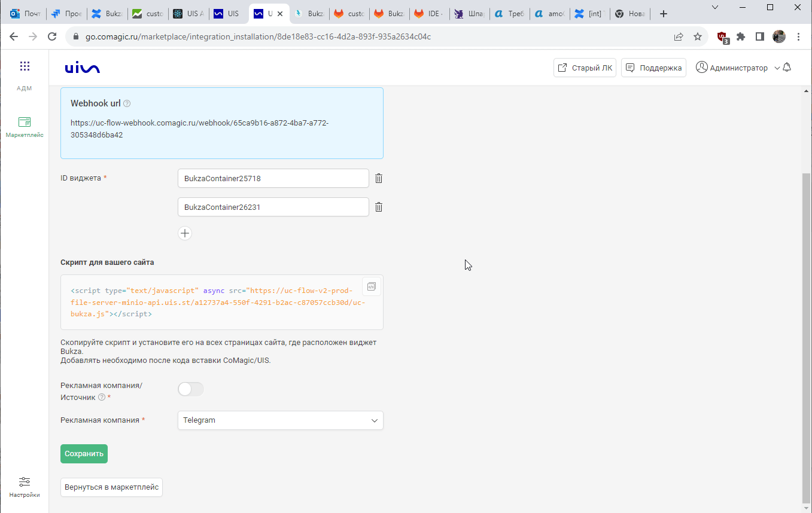
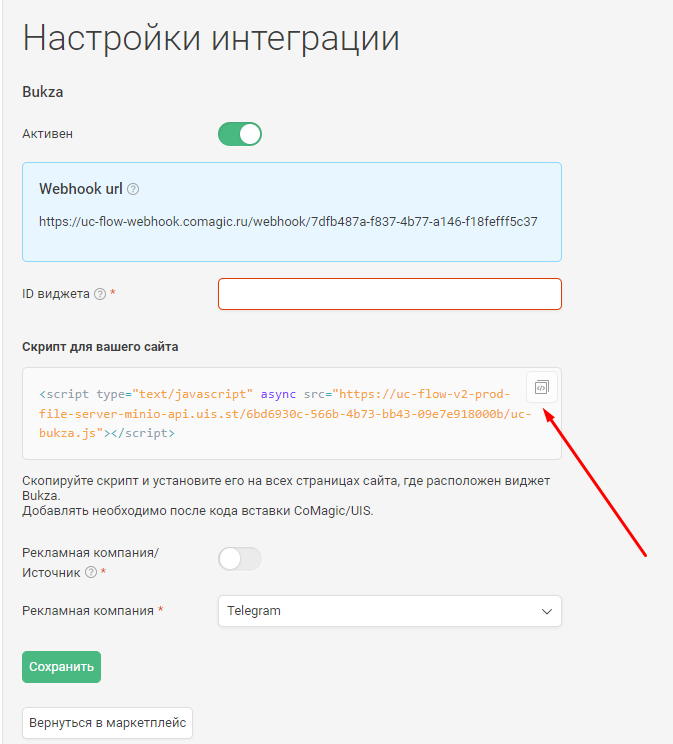

### Интеграция с Bukza
 

**Ценность**   

Решение позволяет настроить передачу заявок, оформленных через виджета онлайн-записи Bukza в CoMagic, для дальнейшего построения Сквозной аналитики. 

 **Какие данные передаются**    
- контактные данные (имя,телефон,email);
- дату и время создания;
- данные сессии (рекламную компанию, источник, UTM-метки и тд);
- в случае отсутствия сессии, дефолтную РК или источник.   

**Необходимые компоненты для работы интеграции**  
- Загрузка оффлайн-заявок из внешней системы.  

**Настройка интеграции**  
1. Нажмите "Активен" на этой странице.
2. Заполните поля в настройках.  

- **Настройка Webhook**
 

  
 подробнее 
   

	- Шаблоны и интеграции → Веб-запросы → Создать веб-запрос
	  - Указываем название
	  - В URL указываем Webhook url из настроек интеграции
	  - Проставляем галочку POST запрос и в тело добавляем следующий json
	  
		> {  
	"date_time": "[bukza_created_date]",  
	"name": "[bukza_full_name]",  
	"phone": "[bukza_phone]",  
	"email": "[bukza_email]",  
	"message": "Номер заказа: [bukza_order_id]; Код бронирования: [bukza_code]",  
	"visitor_session_id": "[bukza_n2]"  
	}  
	
	  - Сохраняем 
	
	- Триггеры → Добавить задачу 
	  - Добавляем действие "Отправить веб-запрос" и выбираем созданный ранее веб-запрос
	
	  - "Если в заказе несколько бронирований?" выбираем Выполнить для каждого
	
	  - Сохраняем 
	
	

  

 

- **ID виджета** - у каждого виджета в Bukza уникальный id . Необходимо добавить список всех виджетов, с которыми требуется подключить интеграцию.   
ID можно взять из кода виджета. 

 

- **Рекламная компания/источник** - необходимо выбрать какую сущность использовать для обращений без сессии.  
По умолчанию выбрана Рекламная компания (маркер не прожат), при прожатии маркера выбирается Источник.  
В зависимости от положения маркера выводится либо список РК из личного кабинета клиента, либо список источников и сайтов. Необходимо указать какую РК/источник и сайт используем в случае отсутствия сессии.

  

3. Нажмите сохранить.
4. После сохранения будет выведен скрипт, который необходимо установить на сайт в соответствие с описанием в настройках.

 

После подключения интеграции заявки будут попадать в  Сырые данные -> Обращения и цели.   
Для проверки корректности работы интеграции оставьте тестовое обращение в форме онлайн-записи Bukza на сайте. 
