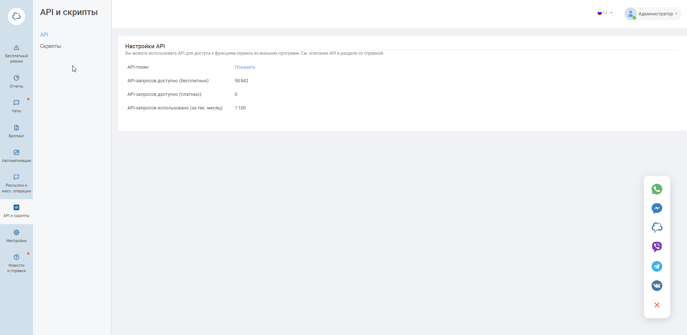

### Сhat2desk. Передача чатов  
 

**Ценность интеграции**  
Интеграция позволяет получать данные по чатам в наш кабинет для построение аналитики.  
 

**Возможности интеграции**  
1. Передача чатов из виджета Chat2Desk.  
2. Передача чатов мессенджеров из виджета Chat2Desk.  
3. Принудительная загрузка чатов в одну настроенную РК или источник.  
 

**Какие данные передаются**  
- контактные данные (имя,телефон,email).  
- дата и время создания.  
- данные сессии (рекламную кампанию, источник, UTM-метки и тд).  
- в случае отсутствия сессии, дефолтную РК или источник.  
 

  **Необходимые кампоненты для работы интеграции**  
- Загрузка чатов из внешней системы.
 

**Настройка интеграции**  
1. Нажмите "Активен" на этой странице.
2. **Авторизация в Chat2desk**  
В поле Авторизация в Chat2desk вводим ключ АПИ Chat2desk.  

Как получить ключ АПИ в Chat2Desk.  

 

3. В поле **Сотрудник по умолчанию** выбираем сотрудника который будет указан в переписке чата.
4. **Игнорировать сессию** — при прожатии все обращения будут загружаться принудительно в выбранную клиентом дефолтную РК или источник (в зависимости от выбранных ниже значений).
5. **Тип трафика** — необходимо выбрать какую сущность использовать для обращений без сессии.    
- В зависимости от выбранного **типа трафика** выводится либо список источников и сайтов  из личного кабинета клиента, либо список рекламных кампаний. Необходимо указать какой **источник и сайт/рекламную кампанию** используем в случае отсутствия сессии.   
- В разделе **Соответствие мессенджеров и источников** настраиваем в какую РК/Источник будут попадать чаты из мессенджеров с неопределившейся сессией.   
 

6. Нажмите сохранить.  

Для проверки работы интеграции оставьте тестовый чат и проверьте его попадание в личный кабинет.  

