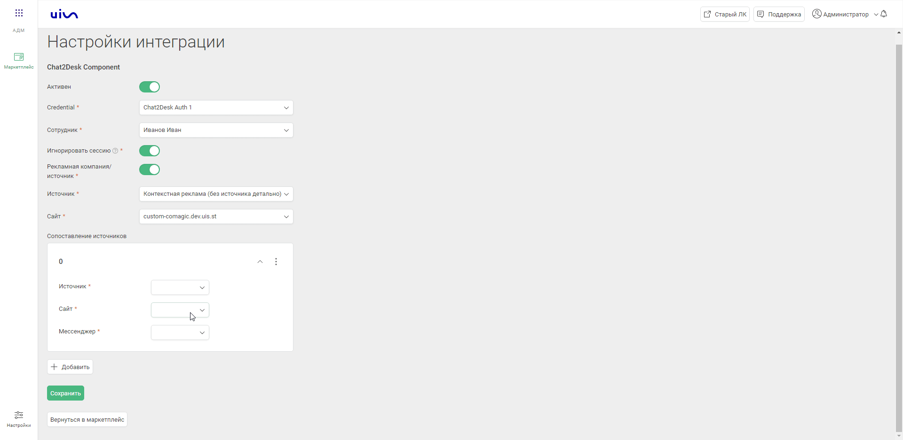

### Сhat2desk. Передача чатов  

**Ценность интеграции**  
Интеграция позволяет получать данные по чатам в наш кабинет для построение аналитики.  

**Возможности интеграции**  
1. Передача чатов из виджета Chat2Desk.  
2. Передача чатов мессенджеров из виджета Chat2Desk.  
3. Принудительная загрузка чатов в одну настроенную РК или источник.  

**Какие данные передаются:**  
В заявку передаем:

- контактные данные (имя,телефон,email).  
- дата и время создания.  
- данные сессии (рекламную компанию, источник, UTM-метки и тд).  
- в случае отсутствия сессии, дефолтную РК или источник.  

**Необходимые компоненты для работы интеграции**  
- Загрузка чатов из внешней системы.

**Настройка интеграции**  
1. Включаем интеграцию переключателем активации.  
2. В поле Авторизация в Chat2desk вводим ключ АПИ Chat2desk.  

Как получить ключ АПИ в Chat2Desk.  
  
4. В поле "Сотрудник по умолчанию" выбираем сотрудника на которого будут назначаться чаты.  
5. Выбираем нужно ли нам игнорировать сессию в пункте "Игнорировать сессию". Данная настройка нужна для загрузки всех обращений в одну РК или Источник.  
6. В разделе "Рекламная компания/источник" выбираем сущность в которую будут грузится обращения без сессии.  
  
7. В разделе "Сопоставление источников"/Сопоставление рекламных компаний выбираем сопоставление каналов мессенджеров с РК/Источниками.  
  
8. Сохраняем интеграцию.  

Для проверки работы интеграции оставьте тестовый чат и проверьте его попадание в личный кабинет.  

