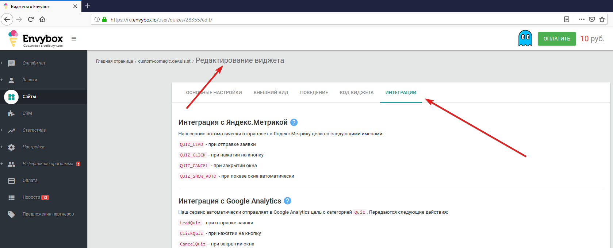
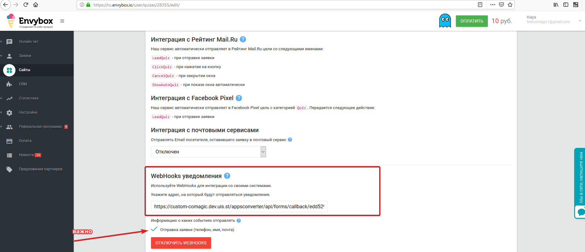
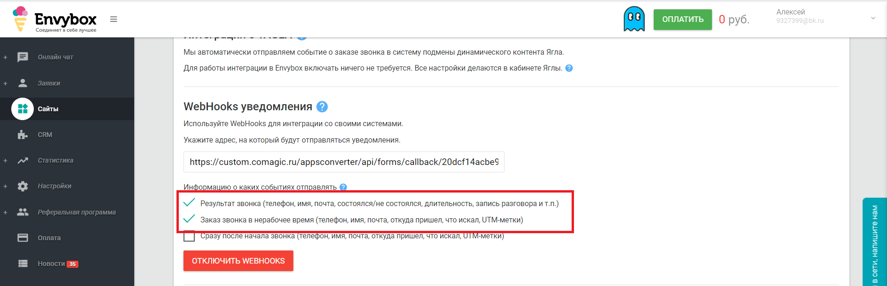

### EnvyBox:передача заявок и чатов 
  
 
**Ценность**     
 
Для получения возможности анализировать эффективность рекламных источников в едином интерфейсе организована передача обращений с виджетов Envybox на сайтах клиента в ЛК CoMagic.  
 

**Возможности интеграции**   
Интеграция позволяет передавать информацию в наш ЛК cо следующих виджетов Envybox:  

- обратный звонок, лидогенератор, квизы в качестве заявок;
- чаты  в качестве чатов.
 

**Какие данные передаются**    
  
- контактные данные (имя,телефон,email);  
- дата и время создания;  
- вопросы/ответы опроса;
- данные сессии (рекламную компанию, источник, UTM-метки и тд);  
- в случае отсутствия сессии, дефолтную РК или источник.  
 

**Необходимые компоненты для работы интеграции**  
- Загрузка оффлайн-заявок из внешней системы.
  

### Подключение интеграции  
    
 
Интеграция подключается в несколько шагов:  
1. Нажмите "Активен" на этой странице.
2. Выполните настройку интеграции.  

- **Настройте Webhook в Envybox** 

  
 Подробнее 
  
  В  Envybox необходимо настроить Webhook на "Webhook url" сервиса CoMagic/UIS из настроек.   
  a. Заходим в  Envybox и выбираем виджет, с которым необходимо произвести настройку и нажимаем настроить.   
  b. Далее в настройках заходим в раздел "Интеграции".  
  c. В поле "WebHooks уведомления" добавляем наш "Webhook url", а также проставляем галочки в событиях, по которым необходимо слать Webhook.
 
     
  Для виджета обратного звонка нужно прожать чек-боксы для пунктов:  
  - Результат звонка (телефон, имя, почта, состоялся/не состоялся, длительность, запись разговора и т.п.)  
  - Заказ звонка в нерабочее время (телефон, имя, почта, откуда пришел, что искал, UTM-метки)  
    
  Иначе происходит дублирование заявок.
  

 
 

- Через переключатель **Рекламная кампания/Источник** выбираем сущность в которую будут передаваться наши чаты без РК.
- В зависимости от положения переключателя "Рекламная кампания/источник" выводится либо список рекламных кампаний из личного кабинета клиента, либо список источников и сайтов. Необходимо указать какую **Рекламную кампанию/источник и сайт** используем в случае отсутствия сессии.

  
 
3. Нажмите сохранить.  
4. После сохранения будет выведен скрипт, который необходимо установить на сайт в соответствие с описанием в настройках. 

После подключения интеграции заявки будут попадать в  Сырые данные -> Обращения и цели.    
Для проверки корректности работы интеграции оставьте тестовое обращение в виджете JivoSite.  

