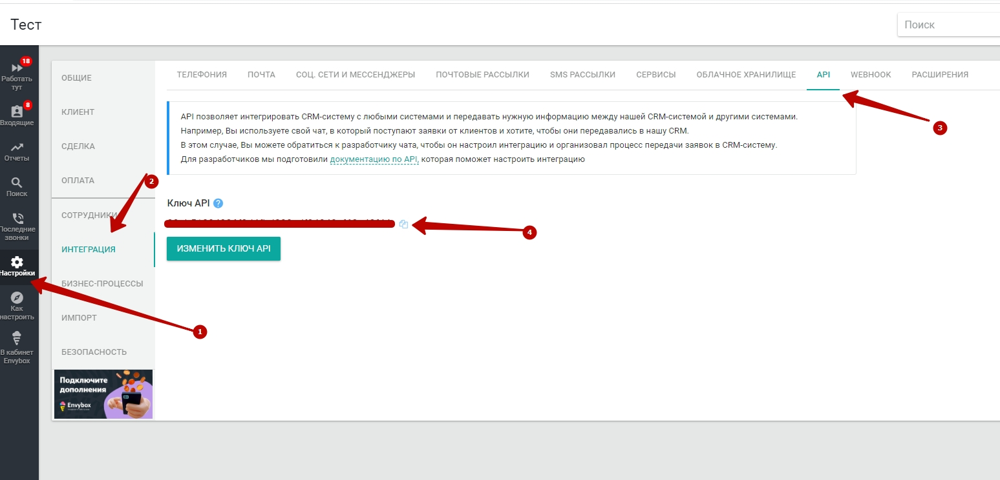
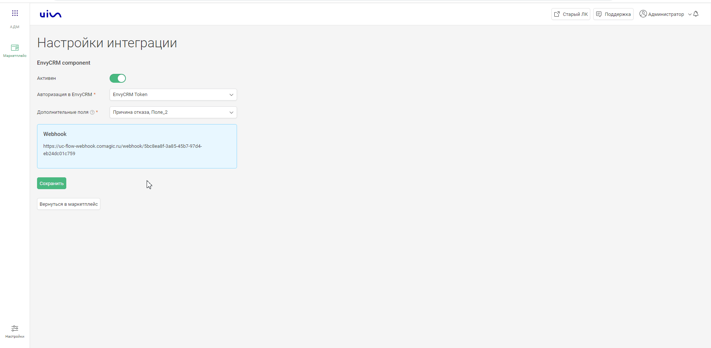
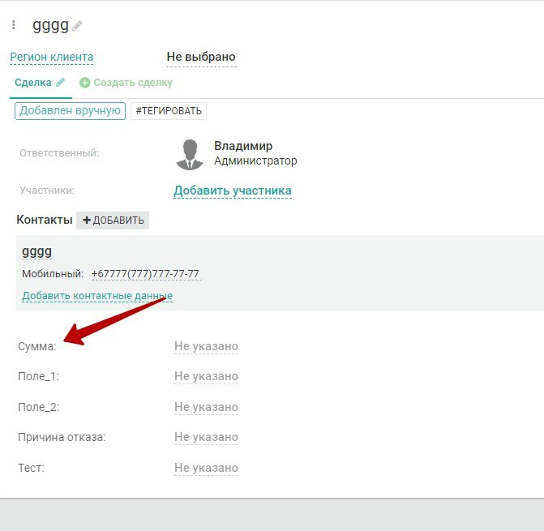

### Интеграция с EnvyCRM    

**Ценность**     

Решение позволяет передавать в наш кабинет данные по сделкам, для дальнейшего построения Сквозной аналитики.   

**Какие данные передаются**    

- сделки: сумма сделки, статус, магазин, к которому относится сделка и тд; 
- воронка продаж и ее этапы;
- контакты;
- кастомные поля (с возможностью выбора).     

**Необходимые компоненты для работы интеграции**  
- Сквозная аналитика.

### Подключение интеграции    

Интеграция подключается в несколько шагов:

1. Нажмите "Активен" на этой странице. 
2. Заполните поля в настройках.  

 - **Авторизация в EnvyCRM**  

Токен генерится в разделе  "Настройки" →  'Интеграция" →  "API"

- **Дополнительные поля** - Выберете дополнительные поля из EnvyCRM, которые необходимо передавать в CoMagic/UIS.
- **Настройка Webhook**  

 
 Подробнее 
   
  
 Создайте триггер в EnvyCRM на Webhook url сервиса CoMagic/UIS из настроек.   

- Настройки -> Интеграция -> Webhook

- Выбираем события "Создание сделки" и "Изменение этапа сделки"

  

 

3. Нажмите сохранить.  
4. Дополнительно в EnvyCRM необходимо создать поле “Сумма” в сделке.
В него необходимо вносить окончательную сумму сделки до перехода в завершающий этап воронки продаж. Название поля должно быть именно "Сумма"

 
  
После подключения интеграции сделки будут попадать в  Сырые данные -> Сделки.     
Для проверки корректности работы интеграции создайте тестовую сделку в EnvyCRM .    

