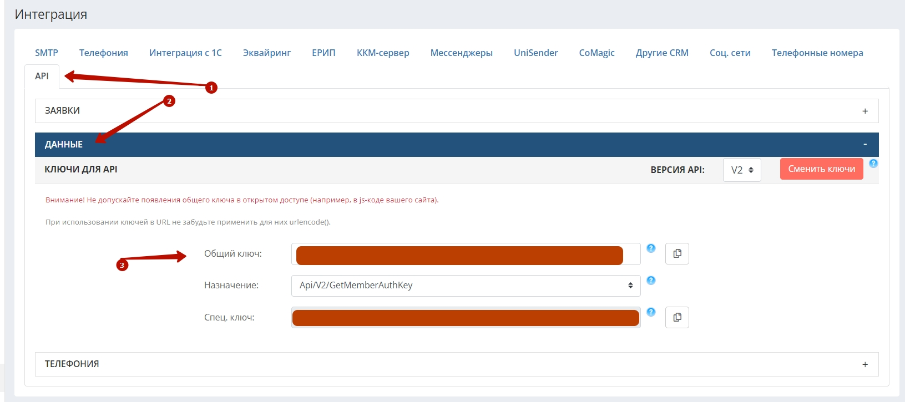

## Интеграция с Hollihop  

Решение позволяет передавать в наш кабинет данные по сделкам, для дальнейшего построения Сквозной аналитики, а также интегрировать функционал телефонии и передавать данные по звонкам в Hollihop.  

**Какие данные передаются**  

Данные получаемые по сделкам:     
- сделки: сумма сделки, статус, филиал, к которому относится сделка и тд; 
- воронка продаж и ее этапы;
- контакты;
- ответственный менеджер;
- доп. поля (дисциплина, уровень, категория, причина отказа).
 

Данные передаваемые по звонкам:   

- всплывающие уведомления о входящих и исходящих звонках;
- звонок в один клик из Hollihop;
- история общения с клиентом с возможностью прослушивания записанных разговоров.  

 
 
 
 

## Подключение передачи сделок    

 
 Шаги по подключению 
  

Интеграция подключается в несколько шагов: 

1. Нажмите "Активен" на этой странице. 
2. Для того, чтобы мы могли передавать сумму сделки в наш ЛК, Hollihop добавили новый параметр “Бюджет” в лиде.  
Каждому клиенту индивидуально требуется направить запрос в Hollihop по добавлению данного поля в лид, так как оно по умолчанию скрыто.    
Соответственно после его добавления, сумму сделки необходимо отображать в нем.  
3. Заполните поля в настройках.  

- **Hollihop Credential**  

 
 Подробнее 
    

   - Заполните название
   - Укажите URL (домен Hollihop ) в формате https://uiscom.t8s.ru , часть 'uiscom.t8s' у каждого клиента уникальна
   - Укажите API key — ключ API Hollihop, находится в Настройки → Интеграция → API → раздел 'Данные' → Общий ключ 

  

 

- **Все сделки в дефолтную воронку “Сделки из Hollihop”** — по умолчанию, если маркер не прожат , будут созданы воронки под каждый филиал, соответственно сделки будут распределяться по ним. При прожатии , все сделки будут переданы в 1 воронку.  

4. Нажмите сохранить  

После подключения интеграции сделки будут попадать в  Сырые данные -> Сделки.  
Сделки грузятся раз в сутки, поэтому корректность работы интеграции можно будет проверить на следующий день.  

 

 
 
 
 
 
 
 

## Подключение телефонии    

 
 Шаги по подключению 
  

1. Укажите **Учетные данные**  

2. Настройте вебхук-методы в Hollihop.  

Перейдите в аккаунт Hollihop, вкладка Телефония, поставьте галочку в чек-боксе Использовать API для телефонии и заполните поля:

- в поле Исходящий вызов вставляем URL из настроек интеграции в UIS . 
- в поле Завершение звонка: https://custom.uiscom.ru/hollihop/api/call/end/
- в поле Ключ вставляем ключ API пользователя UIS, по которому авторизовались

 

 
