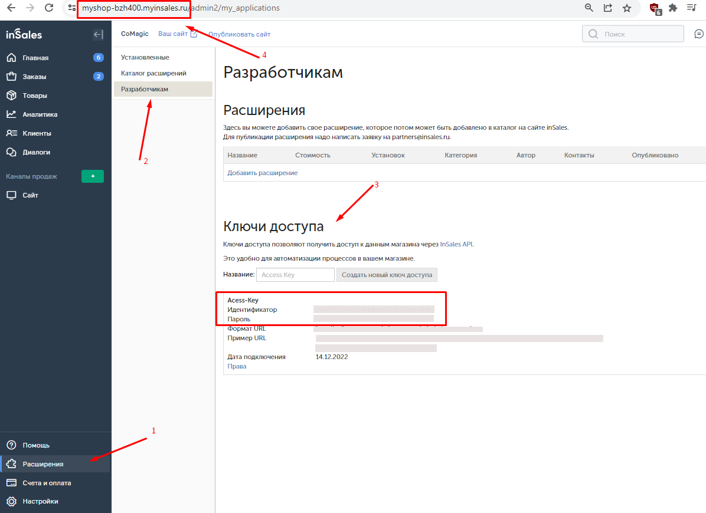

### Интеграция с InSales   

**Ценность**     

Решение позволяет передавать в наш кабинет данные по сделкам, для дальнейшего построения Сквозной аналитики.   

 **Какие данные передаются**   

- сделки: сумма сделки, статус, даты изменений и тд;  
- воронка продаж и ее этапы;  
- контакты;  
- доп. поля (первый источник, последний источник, товары).    

В качестве сделки выступает сущность заказа.  Все сделки передаем в одну воронку продаж “Сделки из InSales"  

**Необходимые компоненты для работы интеграции**    
- Сквозная аналитика.  

### Подключение интеграции   

Интеграция подключается в несколько шагов:
1.	Нажмите "Активен" на этой странице.   
2.	Заполните обязательные поля в настройках (Идентификатор, Пароль, Домен)    

Идентификатор , пароль и домен InSales можно найти в ЛК InSales:  
Расширения → Разработчикам → Ключи доступа  
  
Ключи доступны на Тарифах "Омни" или "Премиум".

  

3.	Нажмите сохранить   

После подключения интеграции сделки будут попадать в  Сырые данные -> Сделки.    
Для проверки корректности работы интеграции создайте тестовую сделку в InSales.   

