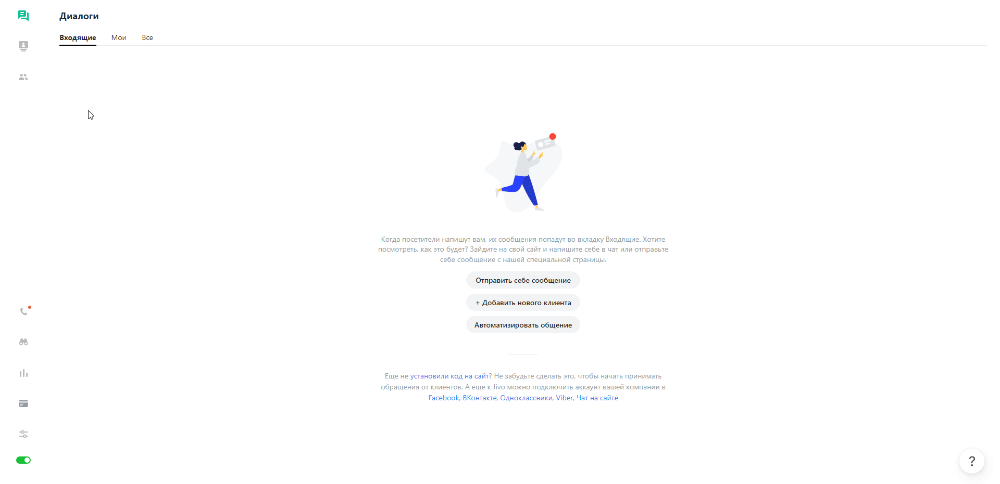
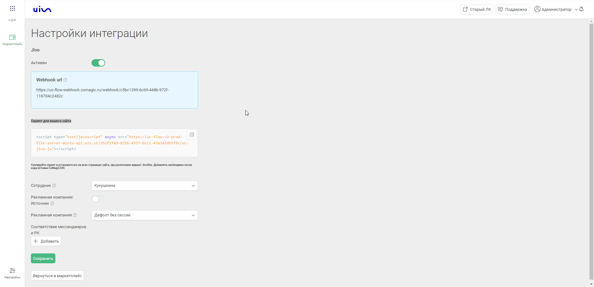
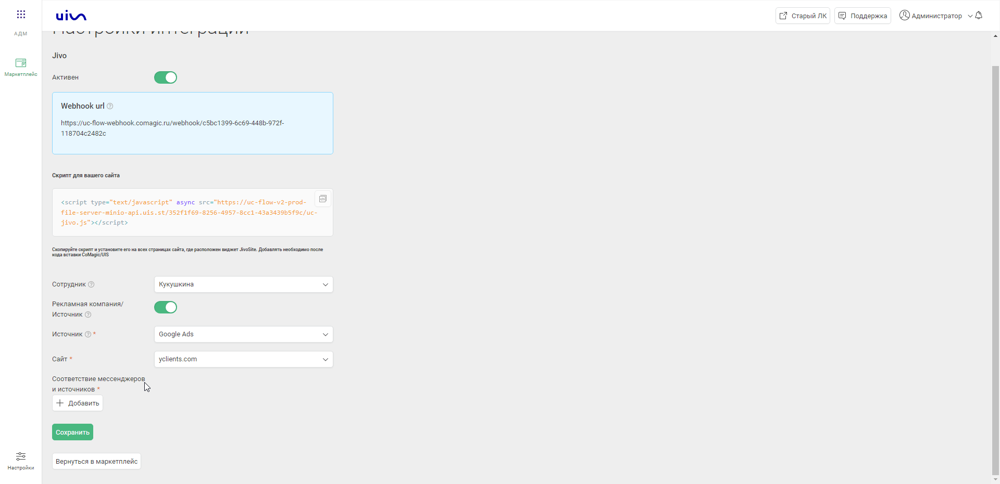

### Jivosite: передача чатов   
**Ценность**    
Интеграция позволяет передавать чаты из онлайн-виджета и мессенджеров в наш кабинет для построения аналитики.    

**Функционал интеграции**  
- Передача онлайн-чатов из виджета.  
- Передача чатов мессенджеров из виджета.  
- Передача чатов мессенджеров оставленных не через виджет. 
 

**Какие данные передаются**   
- контактные данные (имя,телефон,email);  
- дату и время создания;  
- данные сессии (рекламную кампанию, источник, UTM-метки и тд);  
- в случае отсутствия сессии, дефолтную РК или источник;  
- текст чата.  
 

**Необходимые для подключения компоненты:**  
- Загрузка чатов из внешней системы в нашем ЛК.
- Pro версия в JivoSite.   
 

**Настройка интеграции**  
1. Нажмите "Активен" на этой странице.
2. Заполните настройки интеграции  

  
 Настройте Webhook в Jivosite 
  
В Jivosite необходимо настроить Webhook на "Webhook url" сервиса CoMagic/UIS из настроек.   
a. Заходим в  Jivosite в раздел Управление -> Каналы связи , выбираем нужные сайт/мессенджер и нажимаем настроить.   
b. Далее в настройках заходим в раздел "Настройки интеграции для разработчиков".  
c. Нажимаем "Включить Webhooks" и в поле "URL для Webhooks" добавляем наш "Webhook url".
  

 
 

- В разделе **Сотрудник**  выбираем сотрудника на которого будут назначаться полученные чаты.  
- Через переключатель **Рекламная кампания/Источник** выбираем сущность в которую будут передаваться наши чаты без РК.
- В зависимости от положения переключателя "Рекламная кампания/источник" выводится либо список рекламных кампаний из личного кабинета клиента, либо список источников и сайтов. Необходимо указать какую **Рекламную кампанию/источник и сайт** используем в случае отсутствия сессии.
  
- В разделе **Соответствие мессенджеров и источников** настраиваем в какую РК/Источник будут попадать чаты из мессенджеров с неопределившейся сессией.  

3. Нажмите сохранить.  
4. После сохранения будет выведен скрипт, который необходимо установить на сайт в соответствие с описанием в настройках. 
 
После подключения интеграции заявки будут попадать в  Сырые данные -> Обращения и цели.    
Для проверки корректности работы интеграции оставьте тестовое обращение в виджете JivoSite.  

