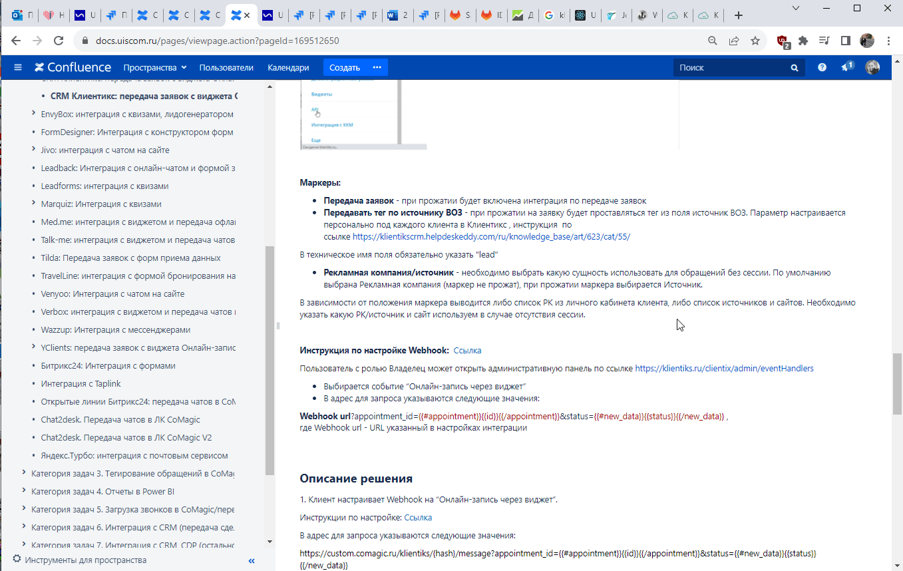

### Интеграция с Клиентикс CRM    

**Ценность**     

Решение позволяет передавать в наш кабинет заявки, оставленные клиентами в форме Онлайн-записи, а также сделки из Клиентикс CRM, для дальнейшего построения Сквозной аналитики.   

**Какие данные передаются**     

Данные получаемые по сделкам:   
- сделки: сумма сделки, название, даты изменения и тд; 
- воронка продаж и ее этапы;
- контакты;
- ответственный менеджер;
- дополнительные поля.     

Данные получаемые по заякам:   

- контактные данные (имя,телефон,email);  
- дату и время создания; 
- данные сессии (рекламную кампанию, источник, UTM-метки и тд);  
- в случае отсутствия сессии, дефолтную РК или источник.    
  

### Подключение загрузки сделок     

**Необходимые кампоненты для работы интеграции**     
- Сквозная аналитика в нашем сервисе
- Подключить один из тарифов "PRO+" или "APIdd" в Клиентикс CRM    

  
  Шаги по подключению 
  
  
1. Нажмите "Активен" на этой странице.    
2. Заполните настройки интеграции.      

**Авторизация в Клиентикс CRM**    

Для авторизации в Клиентикс и дальнейшей возможности совершать запросы к API, необходимо добавить :

- название
- account_id,  user_id и access_token от Клиентикс : Меню → Настройки → API

 

**Настройте Webhook в Клиентикс CRM**  

  
 Подробнее 
  

Инструкция по настройке Webhook [по ссылке](https://klientikscrm.helpdeskeddy.com/ru/knowledge_base/art/569/cat/29/administrativnaja-panel-dlja-sozdanija-uvedomlenij-webhook-po-sobitijam-v-sisteme)  
Пользователь с ролью Владелец может открыть административную панель [по ссылке](https://klientiks.ru/clientix/admin/eventHandlers) 

- Для событий “Запись клиента на прием” и “Онлайн-запись через виджет” в адрес для запроса указываются следующие значения:  
**Webhook url**?appointment_id={{#appointment}}{{id}}{{/appointment}}&status={{#new_data}}{{status}}{{/new_data}} ,   
где Webhook url - URL указанный в настройках интеграции

- Для события “Перенос визита, изменение длительности, изменение статуса” в адрес для запроса указываются следующие значения: 
**Webhook url**?appointment_id={{#new_data}}{{id}}{{/new_data}}&status={{#new_data}}{{status}}{{/new_data}} ,   
где Webhook url - URL указанный в настройках интеграции

   

**Переключатели:**  
- **Передача сделок** - при прожатии будет включена интеграция по передаче сделок.
- **Сотрудник-исполнитель /автор записи** - определяет какая сущность будет использоваться в качестве ответственного сотрудника: не прожатый маркер - сотрудник-испольнитель , прожаты - автор записи.
 

3. Нажмите сохранить.  

После подключения интеграции сделки будут попадать в  Сырые данные -> Сделки.   
Для проверки корректности работы интеграции создайте тестовую сделку(запись) в Клиентикс.  

 
 
  

### Подключение интеграции с Онлайн-виджетом    

**Необходимые компоненты для работы интеграции**   
- Загрузка оффлайн-заявок из внешней системы в нашем сервисе
- Подключить один из тарифов "PRO+" или "APIdd" в Клиентикс CRM  

  
  Шаги по подключению 
  

1. Нажмите "Активен" на этой странице.   
2. Заполните настройки интеграции     

**Авторизация в Клиентикс CRM**    

Для авторизации в Клиентикс и дальнейшей возможности совершать запросы к API, необходимо добавить :

- название
- account_id,  user_id и access_token от Клиентикс : Меню → Настройки → API

   

**Настройте Webhook в Клиентикс CRM**  

  
 Подробнее 
  

Инструкция по настройке Webhook [по ссылке](https://klientikscrm.helpdeskeddy.com/ru/knowledge_base/art/569/cat/29/administrativnaja-panel-dlja-sozdanija-uvedomlenij-webhook-po-sobitijam-v-sisteme)  
Пользователь с ролью Владелец может открыть административную панель [по ссылке](https://klientiks.ru/clientix/admin/eventHandlers) 
  
 
- Выбирается событие “Онлайн-запись через виджет”   
- В адрес для запроса указываются следующие значения:  
**Webhook url**?appointment_id={{#appointment}}{{id}}{{/appointment}}&status={{#new_data}}{{status}}{{/new_data}} ,   
где Webhook url - URL указанный в настройках интеграции

 

  

**Переключатели:**  
- **Передача заявок** - при прожатии будет включена интеграция по передаче заявок
- **Передавать тег по источнику ВОЗ** - при прожатии на заявку будет проставляться тег из поля источник ВОЗ. Параметр настраивается персонально под каждого клиента в Клиентикс , инструкция [по ссылке](https://klientikscrm.helpdeskeddy.com/ru/knowledge_base/art/623/cat/55/)   
В техническое имя поля обязательно указать "lead"
- **Рекламная кампания/источник** - необходимо выбрать какую сущность использовать для обращений без сессии. По умолчанию выбрана Рекламная кампания (маркер не прожат), при прожатии маркера выбирается Источник.  
- В зависимости от положения маркера выводится либо список РК из личного кабинета клиента, либо список источников и сайтов. Необходимо указать какую РК/источник и сайт используем в случае отсутствия сессии.    

3. Нажмите сохранить.   

После подключения интеграции заявки будут попадать в  Сырые данные -> Обращения и цели.    
Для проверки корректности работы интеграции оставьте тестовую запись в виджете Клиентикс.   

 

 

