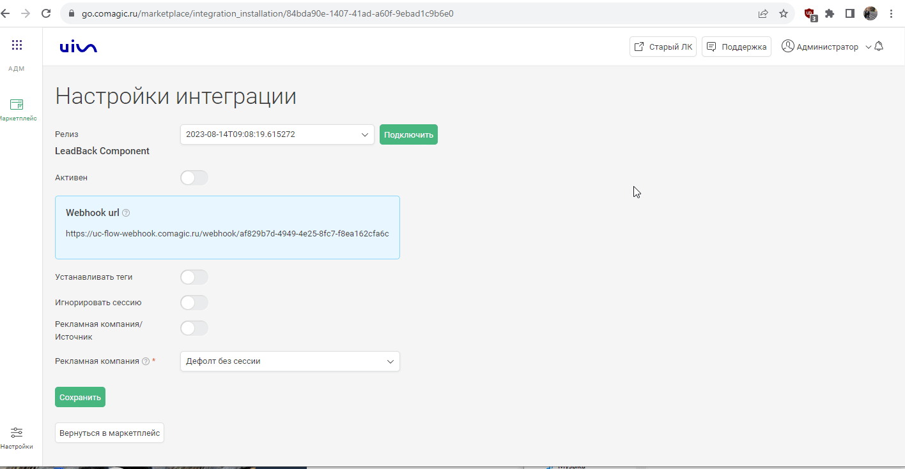

### Интеграция с Leadback  

**Ценность**    

Решение позволяет настроить передачу заявок с обратного звонка , а также чатов с онлайн-чата Leadback в CoMagic, для дальнейшего построения Сквозной аналитики.  

 **Какие данные передаются**      
  
В заявку и чат передаем:  

- контактные данные (имя,телефон,email);
- дату и время создания;
- переписку (из чата);
- данные сессии (рекламную кампанию, источник, UTM-метки и тд);
- в случае отсутствия сессии, дефолтную РК или источник.   

**Необходимые компоненты для работы интеграции**   
- В Leadback Продвинутый тариф (для работы с хуками).
- Загрузка оффлайн-заявок из внешней системы в нашем сервисе.
- Загрузка чатов из внешней системы в нашем сервисе.  

### Подключение интеграции  

Интеграция подключается в несколько шагов: 

1. Нажмите "Активен" на этой странице.  
2. Выполните настройку интеграции.  

- **Настройте Webhook в Leadback**  

  
 Подробнее 
    
  
   - Копируем сгенерированный URL из интерфейса Маркетплейса CoMagic/UIS
   - Переходим в личный кабинет Leadback и добавляем вебхук на данный URL. Профиль -> API -> URL адрес обработчика
      

 
 

- **Рекламная кампания/источник** — необходимо выбрать какую сущность использовать для обращений без сессии.
По умолчанию выбрана Рекламная кампания (маркер не прожат), при прожатии маркера выбирается Источник.  
- В зависимости от положения маркера выводится либо список РК из личного кабинета клиента, либо список источников и сайтов. Необходимо указать какую Рекламную кампанию/источник и сайт используем в случае отсутствия сессии. 

- **Расширенные настройки**  

  
 Подробнее 
  

- **Устанавливать теги** — при прожатии маркера выведется дополнительная настройка с выбором тега(ов). Выбранный тег(и) будут проставляться на все обращения из Тильды.
- **Игнорировать сессию** — при прожатии все обращения будут загружаться принудительно в выбранную клиентом дефолтную РК или источник (в зависимости от выбранных ниже значений)

 

 

3. Нажмите сохранить.  

После подключения интеграции заявки будут попадать в  Сырые данные -> Обращения и цели.   
Для проверки корректности работы интеграции оставьте тестовое обращение в форме Leadback на сайте.

