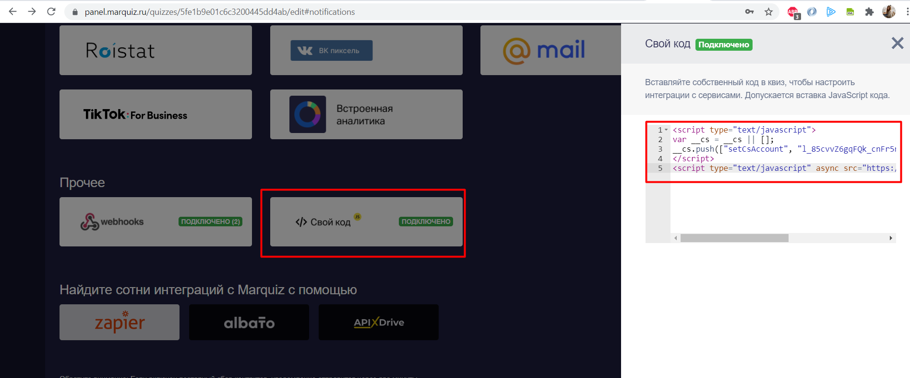

## Интеграция с Marquiz 
 

Интеграция с Marquiz позволяет передавать в наш сервис заявки с квиза для дальнейшего анализа эффективности рекламы.  

**Возможности интеграции**
1. Передача заявок с квизов (виджет на сайте).
2. Передача заявок с лендингов-квизов (отдельная страница квиза на домене mrqz.me/клиентском домене).
 

 **Какие данные передаются**
  
- контактные данные (имя,телефон,email);  
- дату и время создания;  
- вопросы/ответы квиза;
- данные сессии (рекламную кампанию, источник, UTM-метки и тд);  
- в случае отсутствия сессии, дефолтную РК или источник.
   

## Подключение интеграции  

1. Нажмите **"Интеграция активна"** на этой странице.
2. **Название** — укажите название квиза/сайта, с которым подключаете интеграцию. (можете заводить под все квизы одну настройку, либо под каждый квиз подключить интеграцию отдельно)  
3. Настройте **Webhook** в Marquiz  
Скопируйте "Webhook url" из настройки интеграции, разместите в Марквиз и опубликуйте изменения, подробнее **[по ссылке](https://help.marquiz.ru/article/518)** .   

4. Выберете формат загрузки текста заявки:  
  - **Загружать сообщения** —  по умолчанию, при такой настройке будут загружены вопросы и ответы по квизам, если не выбрана настройка **Загружать только ответы**.  
Если настройка **Загружать сообщения** не выбрана, текст заявки будет пустым.  
  - **Загружать только ответы** — при выборе настройки будут загружаться только ответы без вопросов.    
5.**Сайт** - необходимо выбрать сайт для опции создания сессии и обращенний без сессии.    
6. **Тип трафика** — необходимо выбрать какую сущность использовать для обращений без сессии.   
В зависимости от выбранного типа трафика выводится либо список источников и сайтов  из личного кабинета клиента, либо список рекламных кампаний. Необходимо указать какой источник и сайт/рекламную кампанию используем в случае отсутствия сессии.   

  
 Расширенные настройки 
  

  При необходимости, выберите опции:    
- **Игнорировать сессию** — при выборе все обращения будут загружаться принудительно в выбранную клиентом дефолтную РК или источник (в зависимости от выбранных выше значений).
- **Устанавливать теги** — при выборе появится список тегов из ЛК. Необходимо выбрать из данного списка какой тег будет проставляться на обращения с настроенного квиза.
- **Загружать UTM метки** — при выборе будут передаваться UTM метки которые определил сервис Marquiz в текст заявки.
-  **Создавать сессию** - при выборе все обращения, пришедшие без сессии, но с данными по utm-меткам, будут загружаться с искусственно созданной сессией, на основе полученных меток.

 

 

7. Нажмите сохранить.   
8. Если у клиента лендинг с доменом mrqz.me (либо с доменом, незаведенным в нашем ЛК), то дополнительно необходимо:  
 - Завести mrqz.me (или клиентский домен), как отдельный сайт в нашем ЛК.  
**Важно!** Если нужно разбить статистику по разным лендингам то заведите их отдельно, например 12345mrqz.me и 5678mrqz.me и установите уникальный код счетчика на каждый из них.  

 - Настроить на него все необходимые рекламные кампании/источники в нашем ЛК.  
 - В настройках Marquiz в разделе  "Интеграции"-"Свой код" вставить наш основной или уникальный код вставки.

 

 

После подключения интеграции квизы будут попадать в наши отчеты с типом **"Заявки" (Сырые данные -> Обращения и цели)**.    
Для проверки корректности работы интеграции оставьте тестовое обращение в квизе Marquiz.

