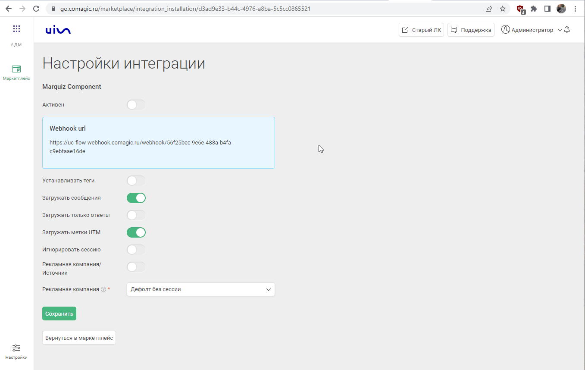

### Интеграция с Marquiz 
 

**Ценность**  
 
Интеграция с Marquiz позволяет передавать в CoMagic заявки с форм/лендингов квиза, для дальнейшего построения Сквозной аналитики.  

**Возможности интеграции**
1. Передача заявок с квизов (виджет на сайте) с информацией о рекламном источнике, текстом квиза, номером телефона/email и именем посетителя.
2. Передача заявок с лендингов-квизов (отдельная страница квиза на домене mrqz.me) с информацией о рекламном источнике (трекаем сессию), при условии заведения данного домена в нашем личном кабинете в качестве отдельного сайта и установки кода вставки CoMagic/UIS на лендинг.
3. Принудительная отправка всех заявок (и с виджета, и с лендинга) в дефолтную рекламную кампанию в CoMagic/UIS.  
 

 **Какие данные передаются**
  
- контактные данные (имя,телефон,email);  
- дату и время создания;  
- вопросы/ответы опроса;
- данные сессии (рекламную кампанию, источник, UTM-метки и тд);  
- в случае отсутствия сессии, дефолтную РК или источник.
   

**Необходимые компоненты для работы интеграции**  
- Загрузка оффлайн-заявок из внешней системы.
 

### Подключение интеграции  

Интеграция подключается в несколько шагов:

1. Нажмите "Активен" на этой странице.
2. Выполните настройки интеграции.  
- **Настройте Webhook в Marquiz**  
В Marquiz необходимо настроить Webhook на "Webhook url" сервиса CoMagic/UIS из настроек.   
Инструкция настройки Webhook в Marquiz [по ссылке](https://help.marquiz.ru/article/518).
- **Рекламная кампания/источник** — необходимо выбрать какую сущность использовать для обращений без сессии. По умолчанию выбрана Рекламная кампания (маркер не прожат), при прожатии маркера выбирается Источник.
- В зависимости от положения переключателя "Рекламная кампания/источник" выводится либо список рекламных кампаний из личного кабинета клиента, либо список источников и сайтов. Необходимо указать какую **РК/источник и сайт** используем в случае отсутствия сессии.

  
 Расширенные настройки 
  

  **Выберете необходимые опции:**    
- **Устанавливать теги** — при прожатии появится список тегов из ЛК. Необходимо выбрать из данного списка какой тег будет проставляться на обращения с настроенного квиза.
- **Загружать сообщения** — прожат по умолчанию, передаются и вопросы, и ответы.
- **Загружать только ответы** — при прожатии будут загружаться только ответы без вопросов.
- **Загружать UTM метки** — при прожатии будут передаваться UTM метки трекнутые самим Марквизом в текст заявки.
- **Игнорировать сессию** — при прожатии все обращения будут загружаться принудительно в выбранную клиентом дефолтную РК или источник (в зависимости от выбранных ниже значений)

 

 
3. Нажмите сохранить.
 

После подключения интеграции заявки будут попадать в  Сырые данные -> Обращения и цели.    
Для проверки корректности работы интеграции оставьте тестовое обращение в квизе Marquiz.

