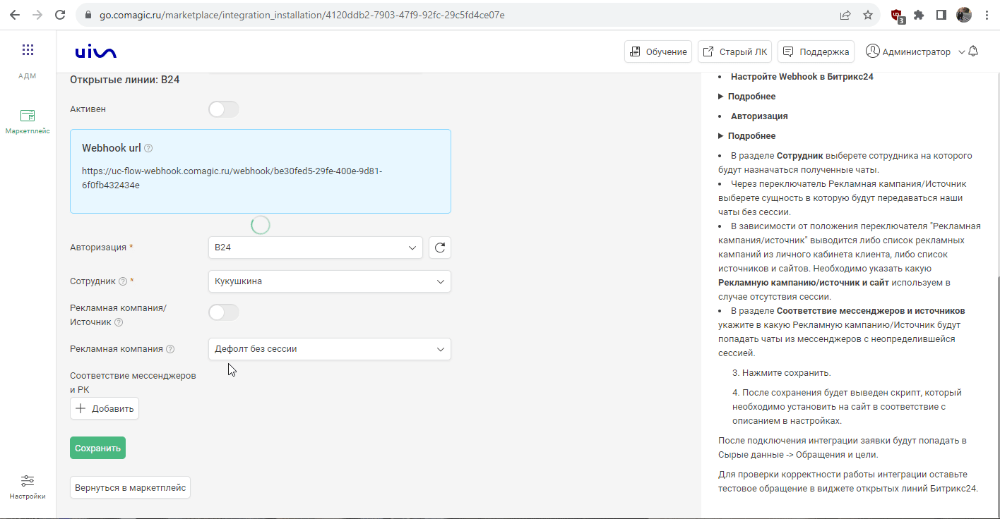

## Интеграция с Открытые линии Битрикс24  

Решение позволяет настроить передачу чатов из онлайн-виджета и месседжеров Битрикс24 в наш сервис для дальнейшего анализа эффективности рекламы.    

**Какие данные передаются**   
- контактные данные (имя,телефон,email);  
- дата и время создания;  
- данные сессии (рекламную кампанию, источник, UTM-метки и тд);  
- в случае отсутствия сессии (по мессенджерам), дефолтную РК или источник;  
- текст чата.  
 

**Настройка интеграции**  
1. Нажмите "Активен" на этой странице.
2. Заполните **учетные данные**.   
  

  
 Подробнее 
   
  
   - Для авторизации, необходимо завести локальное приложение в Битрикс24 . Разработчикам → Другое → Локальное приложение.
   - В приложении указать след URL  https://uc-http-requester-prod-api.comagic.ru/oauth2/callback
   - Добавьте следующие права: CRM (crm), Открытые линии (imopenlines), Чат и уведомления (im), Контакт-центр (contact_center).
   - В нем будут выданы ключ и id юзера, которые необходимо ввести в Авторизации в настройках интеграции.
   - Дополнительно необходимо изменить в поле Authorization URL часть **YOURDOMAIN**, на домен от вашего ЛК Битрикс24.  
     Если у вас нестандартный адрес от ЛК Битрикс24 (например b24.excurspb.ru), то замените следующую часть URL **YOURDOMAIN.bitrix24.ru** на вашу (например b24.excurspb.ru). 
  
  

 
 

3. Настройте **Webhook** в Битрикс24.   
  

  
 Подробнее 
    
  
   - Настройте исходящий веб-хук на событие "Создание лида (ONCRMLEADADD)" или "Создание сделки  (ONCRMINVOICEADD) в зависимости от того, какая сущность создается по факту чата
   - В поле "URL вашего обработчика" необходимо указать адрес из поля "Webhook url" из настройки интеграции.
    
  

 
 

4.  **Сотрудник по умолчанию**  — выберете сотрудника, который будет указан в переписке чата.  
5.  **Тип трафика** — необходимо выбрать какую сущность использовать для обращений без сессии. По умолчанию выбран Источник.    
В зависимости от выбранного **типа трафика** выводится либо список источников и сайтов  из личного кабинета клиента, либо список рекламных кампаний. Необходимо указать какой **источник и сайт/рекламную кампанию** используем в случае отсутствия сессии.     
6. В разделе **Соответствие мессенджеров и источников** укажите в какой Источник/рекламную кампанию будут попадать чаты из мессенджеров с неопределившейся сессией.    
  
  
  
   
7. Нажмите сохранить.  
8. После сохранения будет выведен скрипт, который необходимо скопировать и установить на всех страницах сайта, где расположен виджет Открытых линий Битрикса24. Добавлять необходимо после кода вставки UIS. 
 

После подключения интеграции заявки будут попадать в  Сырые данные -> Обращения и цели.    
Для проверки корректности работы интеграции оставьте тестовое обращение в виджете открытых линий Битрикс24.  
