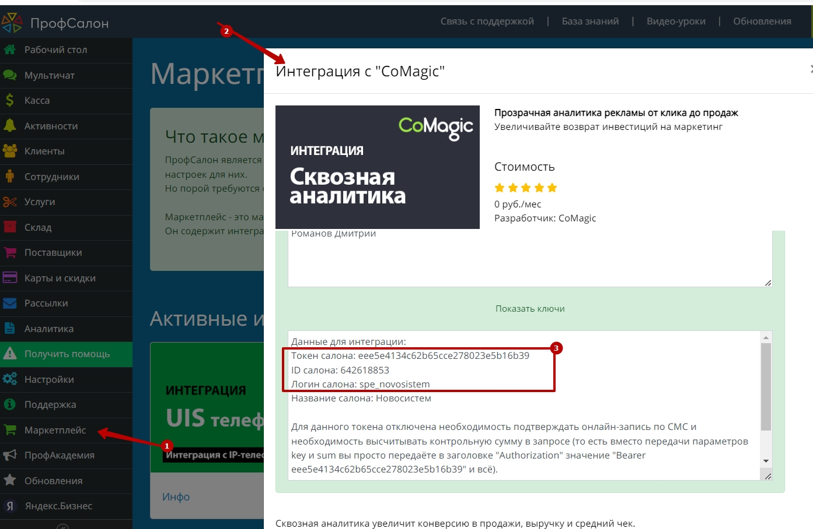
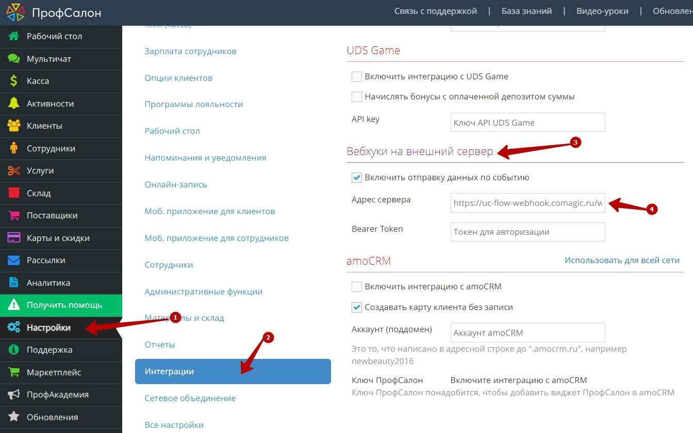

### Интеграция с ПрофСалон 
 **Ценность**    
Решение позволяет передавать в наш кабинет заявки, оставленные клиентами в форме Онлайн-записи, а также сделки из ПрофСалона, для дальнейшего построения Сквозной аналитики.  
**Какие данные передаются**   

Данные получаемые по сделкам:  
- сделки: сумма сделки, название, даты изменения и тд; 
- воронка продаж и ее этапы;
- контакты;
- ответственный менеджер;
- дополнительные поля.  
 
Данные получаемые по заякам:  

- контактные данные (имя,телефон,email)  
- дату и время создания  
- передача обращений в дефолтную РК или источник  

### Подключение интеграции с Онлайн-виджетом   
  

Необходимые компоненты для работы интеграции   
- Загрузка оффлайн-заявок из внешней системы в нашем сервисе   

Интеграция подключается в несколько шагов:

1. Нажмите "Активен" на этой странице.
2. Заполните настройки интеграции   

**Авторизация** 
В Маркетплейсе ПрофСалона необходимо подключить интеграцию с CoMagic. После ее подключения будут выведены данные для авторизации (токен, ID салона, логин салона)

Необходимо заполнить эти данные в настройках интеграции.

 

**Маркеры:** 
- Передача заявок - при прожатии будет включена интеграция по передаче заявок
- Рекламная компания/источник - необходимо выбрать какую сущность использовать для обращений без сессии. По умолчанию выбрана Рекламная компания (маркер не прожат), при прожатии маркера выбирается Источник.  
В зависимости от положения маркера выводится либо список РК из личного кабинета клиента, либо список источников и сайтов. Необходимо указать какую РК/источник и сайт используем в случае отсутствия сессии.    

3.  Настройте Webhook в Профсалон

В Профсалон необходимо настроить Webhook на создание/изменение сделки. Для этого необходимо направить запрос  в ПрофСалон с просьбой создать хук на наш URL (указан в поле Webhook url).
Если в настройках ПрофСалона есть блок Интеграции → Вебхуки на внешний сервер , то это можно сделать самостоятельно.

   

4. Нажмите сохранить.   

После подключения интеграции заявки будут попадать в  Сырые данные -> Обращения и цели.  
Для проверки корректности работы интеграции оставьте тестовую запись в виджете ПрофСалона.

 

  ### Подключение загрузки сделок   
Необходимые компоненты для работы интеграции
- Сквозная аналитика в нашем сервисе
 

Интеграция подключается в несколько шагов:   
  
1. Нажмите "Активен" на этой странице.
2. Заполните настройки интеграции  
 

**Авторизация**   
В Маркетплейсе ПрофСалона необходимо подключить интеграцию с CoMagic. После ее подключения будут выведены данные для авторизации (токен, ID салона, логин салона)

Необходимо заполнить эти данные в настройках интеграции.  

**Маркеры:** 
- Передача сделок - при прожатии будет включена интеграция по передаче сделок.
- Дефолтная воронка - при прожатии все сделки будут передаваться в воронку по умолчанию "Сделки из ПрофСалона". В противном случае будет создана воронка с названием салона, с которым подключена интеграция.   

3. Настройте Webhook в ПрофСалоне  

В Профсалон необходимо настроить Webhook на создание/изменение сделки. Для этого необходимо направить запрос  в ПрофСалон с просьбой создать хук на наш URL (указан в поле Webhook url).
Если в настройках ПрофСалона есть блок Интеграции → Вебхуки на внешний сервер , то это можно сделать самостоятельно.

   

4. Нажмите сохранить.
 

После подключения интеграции сделки будут попадать в  Сырые данные -> Сделки.  
Для проверки корректности работы интеграции создайте тестовую сделку(запись) в ПрофСалоне.
